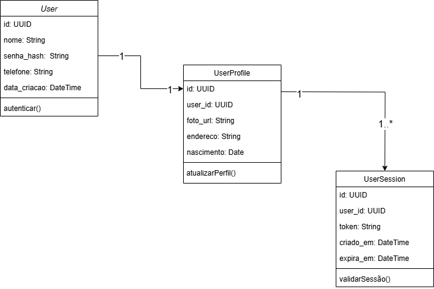
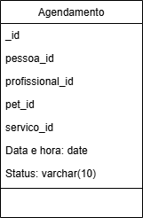

# APIs e Web Services

O projeto visa desenvolver uma aplicação de gestão de pet shop que permita gerenciar de forma eficiente e centralizada os processos operacionais do negócio. A aplicação de APIs Web será responsável por fornecer funcionalidades essenciais para o pet shop, como o controle de estoque de produtos, agendamento de serviços de banho e tosa, cadastro de clientes e pets, além de permitir a integração com sistemas de pagamento e relatórios financeiros. O foco é criar uma solução ágil e segura que otimize o atendimento ao cliente, melhore a organização interna e facilite a expansão do negócio.

## Objetivos da API

O objetivo principal da API para gestão de pet shop é criar uma plataforma robusta, eficiente e acessível para otimizar os processos operacionais do negócio, melhorando a experiência tanto dos funcionários quanto dos clientes. A seguir estão os principais objetivos que a API deve alcançar:

- Gerenciamento de Clientes e Pets

Cadastro e Atualização: Permitir que o sistema registre e atualize informações sobre clientes e seus pets, facilitando o atendimento e a comunicação.
Histórico de Atendimento: A API deve fornecer acesso ao histórico de serviços prestados, como banhos e tosas. 

Controle de Estoque

- Gestão de Produtos: A API deve ser capaz de controlar o estoque de ração, brinquedos, medicamentos e outros produtos vendidos no pet shop.
- Alertas de Reposição: Quando um produto atingir níveis baixos, a API deve gerar alertas para reposição de estoque.

Gestão de Pagamentos

 - Histórico de Transações: Registrar todas as transações realizadas para fins de controle financeiro e geração de relatórios.

 - Autenticação Segura: Garantir que apenas usuários autorizados (administradores e funcionários ) possam acessar as funcionalidades específicas da API.

Controle de Acesso: Implementar níveis de permissão para garantir que diferentes tipos de usuários tenham acesso adequado às informações e funções do sistema.

Escalabilidade e Desempenho

- Alta Performance: A API deve ser otimizada para garantir tempos de resposta rápidos, mesmo com alto volume de requisições.
- Escalabilidade: A arquitetura da API deve permitir que o sistema cresça conforme o pet shop expande suas operações e abre novas unidades.

Usabilidade e Acessibilidade

- Facilidade de Integração: A API deve ser intuitiva e fácil de integrar, oferecendo uma documentação clara.

## Modelagem da Aplicação
[Descreva a modelagem da aplicação, incluindo a estrutura de dados, diagramas de classes ou entidades, e outras representações visuais relevantes.]

### Modelagem de Aplicação - Cadastro de Usuários e Autenticação

Estrutura de Dados - Tabelas

Tabela: users (Armazena os dados principais dos usuários)

| Campo       | Tipo de Dado       | Restrição               | Descrição                        |
|------------|------------------|-----------------------|--------------------------------|
| id         | UUID             | PRIMARY KEY           | Identificador único do usuário  |
| nome       | VARCHAR(100)     | NOT NULL              | Nome completo do usuário        |
| email      | VARCHAR(255)     | UNIQUE, NOT NULL      | E-mail para login               |
| senha_hash | TEXT             | NOT NULL              | Hash da senha                   |
| telefone   | VARCHAR(20)      | NULL                  | Telefone do usuário             |
| data_criacao | TIMESTAMP      | DEFAULT CURRENT_TIMESTAMP | Data de criação da conta |

Tabela: user_profiles (Armazena informações adicionais)

| Campo       | Tipo de Dado       | Restrição               | Descrição                          |
|------------|------------------|-----------------------|--------------------------------|
| id         | UUID             | PRIMARY KEY           | Identificador único do perfil  |
| user_id    | UUID             | FOREIGN KEY (users.id) | Relacionado ao usuário           |
| foto_url   | VARCHAR(255)     | NULL                  | URL da foto de perfil           |
| endereco   | TEXT             | NULL                  | Endereço do usuário             |
| nascimento | DATE             | NULL                  | Data de nascimento              |

Tabela: user_sessions (Gerencia sessões ativas)

| Campo       | Tipo de Dado       | Restrição               | Descrição                        |
|------------|------------------|-----------------------|--------------------------------|
| id         | UUID             | PRIMARY KEY           | Identificador único da sessão  |
| user_id    | UUID             | FOREIGN KEY (users.id) | Relacionado ao usuário          |
| token      | TEXT             | UNIQUE, NOT NULL      | Token de autenticação           |
| created_at | TIMESTAMP        | DEFAULT CURRENT_TIMESTAMP | Data de criação da sessão  |
| expires_at | TIMESTAMP        | NOT NULL              | Data de expiração da sessão |

Cadastro de Serviços

1.Tabela: Serviços  (armazena os serviços oferecidos pelo petshop)

| Campo       | Tipo de Dado       | Restrição               | Descrição                        |
|------------|------------------|-----------------------|-------------------------------- |
| id_servico | INT              | PRIMARY KEY           | Identificador único do serviço  |
|nome_servico| VARCHAR (100)    | NOT NULL, UNIQUE)     | Banho simples, tosa completa    |
| descricao  | TEXT             | NOT NULL              | Descrição detalhada do serviço  |
| preco      | DECIMAL(10,2)    | NOT NULL, CHECK (preco > 0) | Preço do Serviço          |
|disponibilidade| VARCHAR (50)  | NOT NULL              | Dias e Horários disponíveis para o serviço|

2. Tabela: Clientes (armazena as informações dos clientes)
   
| Campo       | Tipo de Dado       | Restrição               | Descrição                        |
|------------|------------------|-----------------------|-------------------------------- |
| id_cliente | INT              | PRIMARY KEY           | Identificador único do cliente  |
|nome_cliente| VARCHAR (15)     | NOT NULL, UNIQUE)     | Nome completo do cliente        |
| telefone   | VARCHAR (15)     | NOT NULL              | Número de telefone de contato do cliente|
| email      | VARCHAR (100)    | NOT NULL              | Email do cliente                |
|endereco    | VARCHAR (255)    | NOT NULL              | Endereço completo do cliente    |

3. Tabela: Pets (armazena informações sobre os pets dos clientes)

| Campo       | Tipo de Dado       | Restrição               | Descrição                        |
|------------|------------------|-----------------------|-------------------------------- |
| id_pet     | INT              | PRIMARY KEY           | Identificador único do pet      |
|id_cliente  | INT              | FK                    | Referência ao cliente, relacionamento com a tabela  clientes|
| nome       | VARCHAR (15)     | NOT NULL              | Nome do pet                     |
| tipo       | VARCHAR (50)     | NOT NULL               | Tipo do pet (Cão, Gato, etc...) |
|raca        | VARCHAR (50)     | NOT NULL               | Raça do pet                     |
|data_nascimento| DATE          | NOT NULL               | Data de nascimento do pet       |
|observacoes| TEXT              | NOT NULL               |Observações sobre o pet(alergias, comportamento, etc)

4. Tabela: Agendamentos ( armazena os serviços solicitados pelos clientes para seus pets)

| Campo       | Tipo de Dado       | Restrição               | Descrição                        |
|------------|------------------|-----------------------|-------------------------------- |
| id_agendamento| INT           | PRIMARY KEY           | Identificador único do agendanento|
|id_servico  | INT              | FK                    |Referência ao serviço solicitado (relacionamento com a tabela Serviços) |
|id_pet      | INT              | FK                    | Referência ao pet (relacionamento com a tabela Pets)|
|id_cliente  | INT              | FK                    | Referência ao cliente (relacionamento com a tabela Clientes).                |
|data_agendamento| DATETIME     | NOT NULL              | Data e horário do agendamento|
|status      | VARCHAR(50)      | NOT NULL              | Status do agendamento (ex: Pendente, Confirmado, Concluído, Cancelado)|    

5. Tabela: Funcionários  ( armazena as informações dos funcionários que atendem os clientes e realizam os serviços)
   
| Campo       | Tipo de Dado       | Restrição               | Descrição                        |
|------------|------------------|-----------------------|-------------------------------- |
|id_funcionario|	INT            | (PK)	                 |Identificador único do funcionário|
|nome	         |VARCHAR(100)    | NOT NULL              |	Nome completo do funcionário|
|cargo	        |VARCHAR(50)	    |  NOT NULL, CHECK      |Cargo do funcionário |
|telefone	     |VARCHAR(15)	    |  NOT NULL             |Número de telefone do funcionário|
|email	        |VARCHAR(100)	   |  NOT NULL             |Email do funcionário|


Diagrama de Classes 





## Tecnologias Utilizadas

Existem muitas tecnologias diferentes que podem ser usadas para desenvolver APIs Web. A tecnologia certa para o seu projeto dependerá dos seus objetivos, dos seus clientes e dos recursos que a API deve fornecer.

[Lista das tecnologias principais que serão utilizadas no projeto.]

## API Endpoints

[Liste os principais endpoints da API, incluindo as operações disponíveis, os parâmetros esperados e as respostas retornadas.]

### Endpoint 1
- Método: GET
- URL: /endpoint1
- Parâmetros:
  - param1: [descrição]
- Resposta:
  - Sucesso (200 OK)
    ```
    {
      "message": "Success",
      "data": {
        ...
      }
    }
    ```
  - Erro (4XX, 5XX)
    ```
    {
      "message": "Error",
      "error": {
        ...
      }
    }
    ```

## Considerações de Segurança

[Discuta as considerações de segurança relevantes para a aplicação distribuída, como autenticação, autorização, proteção contra ataques, etc.]

## Implantação

[Instruções para implantar a aplicação distribuída em um ambiente de produção.]

1. Defina os requisitos de hardware e software necessários para implantar a aplicação em um ambiente de produção.
2. Escolha uma plataforma de hospedagem adequada, como um provedor de nuvem ou um servidor dedicado.
3. Configure o ambiente de implantação, incluindo a instalação de dependências e configuração de variáveis de ambiente.
4. Faça o deploy da aplicação no ambiente escolhido, seguindo as instruções específicas da plataforma de hospedagem.
5. Realize testes para garantir que a aplicação esteja funcionando corretamente no ambiente de produção.

## Testes

[Descreva a estratégia de teste, incluindo os tipos de teste a serem realizados (unitários, integração, carga, etc.) e as ferramentas a serem utilizadas.]

1. Crie casos de teste para cobrir todos os requisitos funcionais e não funcionais da aplicação.
2. Implemente testes unitários para testar unidades individuais de código, como funções e classes.
3. Realize testes de integração para verificar a interação correta entre os componentes da aplicação.
4. Execute testes de carga para avaliar o desempenho da aplicação sob carga significativa.
5. Utilize ferramentas de teste adequadas, como frameworks de teste e ferramentas de automação de teste, para agilizar o processo de teste.

# Referências

Inclua todas as referências (livros, artigos, sites, etc) utilizados no desenvolvimento do trabalho.
