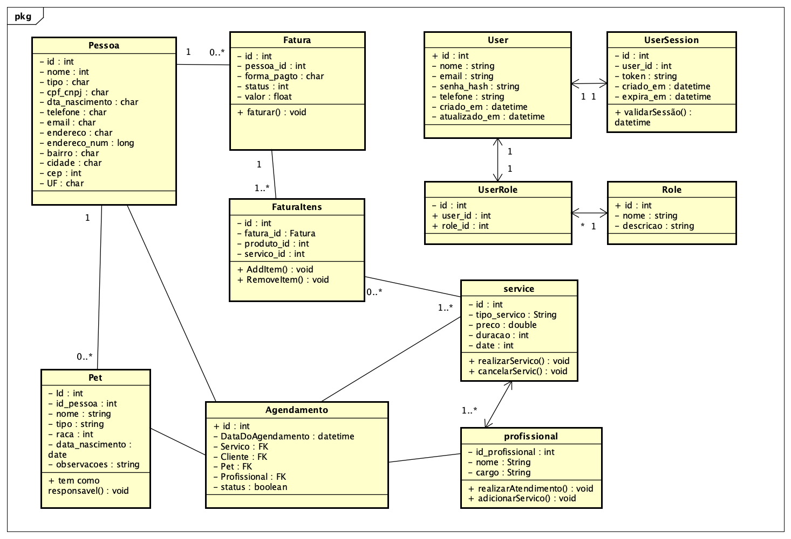

# APIs e Web Services

O projeto visa desenvolver uma aplicação de gestão de pet shop que permita gerenciar de forma eficiente e centralizada os processos operacionais do negócio. A aplicação de APIs Web será responsável por fornecer funcionalidades essenciais para o pet shop, como o controle de estoque de produtos, agendamento de serviços de banho e tosa, cadastro de clientes e pets, além de permitir a integração com sistemas de pagamento e relatórios financeiros. O foco é criar uma solução ágil e segura que otimize o atendimento ao cliente, melhore a organização interna e facilite a expansão do negócio.

## Objetivos da API

A API para gestão do pet shop tem como objetivo simplificar e otimizar as operações de serviços de banho e tosa e controle de vendas de produtos. Seus principais objetivos são:

Gestão de Serviços: Registrar e atualizar serviços de banho e tosa, com acesso ao histórico de atendimentos para monitoramento e análise.

Controle de Vendas e Estoque: Gerenciar as vendas de produtos, como ração e brinquedos, e manter o controle de estoque, alertando sobre reposições necessárias.

Gestão de Pagamentos: Registrar transações de serviços e vendas de produtos, para controle financeiro.

Controle de Acesso: Garantir que apenas usuários autorizados possam acessar e gerenciar as informações sensíveis.

Desempenho e Simplicidade: Assegurar alta performance, com tempos de resposta rápidos e uma arquitetura simples e fácil de usar, proporcionando uma integração eficiente para os colaboradores do pet shop.

Essa API visa atender de maneira eficaz e acessível às necessidades operacionais do pet shop, sem a complexidade de sistemas maiores.

## Modelagem da Aplicação

<<<<<<< HEAD
=======
A estrutura de dados principal se constitui das entidades, requisito funcional:

- Pessoa, RF-002;
- Fatura, RF-008;
- Pet, RF-001;
- User, RF-005;
- Profissional, RF-006;
- Service, RF-004;
>>>>>>> valdeir


## Diagrama de Classes



## Tecnologias Utilizadas

Existem muitas tecnologias diferentes que podem ser usadas para desenvolver APIs Web. A tecnologia certa para o seu projeto dependerá dos seus objetivos, dos seus clientes e dos recursos que a API deve fornecer.

- **PostgreSQL:** Utilizado para criação e utilização do banco de dados.
- **Node.js:** Utilizado para desenvolvimento do backend com JavaScript.
- **Sequelize:** ORM utilizado para conectar e manipular o banco de dados.
- **Express:** Framework utilizado para criar o servidor e as APIs.
- **Json Web Token e Bcrypt:**
  - **Json Web Token:** Utilizado para autenticação do sistema.
  - **Bcrypt:** Utilizado para encriptar a senha do usuário.
- **Swagger:** Utilizado para documentação da API.
- **Jest e Supertest:** Utilizados para testes de integração.

## API Endpoints

### Buscar todos usuários do sistema

- Método: GET
- URL: /api/users
- Parâmetros:  
  _Nenhum_
- Resposta:
  - Sucesso (200 OK)
    ```json
    [
      {
        "id": 1,
        "nome": "Davi",
        "email": "davi@email.com",
        "telefone": "999999999",
        "created_at": "2025-04-06T16:01:12.261Z",
        "updated_at": "2025-04-06T16:01:12.261Z"
      }
    ]
    ```
  - Erro (500 Erro interno do servidor)
    ```json
    {
      "error": "Erro interno ao buscar usuários"
    }
    ```

---

### Criar um novo usuário no sistema

- Método: POST
- URL: `/users`
- Parâmetros (body):
  - `nome`: Nome do usuário
  - `email`: E-mail válido
  - `senha`: Mínimo 8 caracteres, 1 maiúscula, 1 minúscula e 1 caractere especial
  - `telefone`: Telefone do usuário
  - `role_id`: ID da role
- Resposta:
  - Sucesso (201 Created)
    ```json
    {
      "message": "Usuário criado com sucesso",
      "userId": {
        "id": 6,
        "nome": "dasdsa",
        "email": "dasdasd@email.com",
        "telefone": "999999999",
        "updated_at": "2025-04-06T19:33:14.658Z",
        "created_at": "2025-04-06T19:33:14.658Z"
      }
    }
    ```
  - Erro (400, 409, 500)
    ```json
    {
      "error": "E-mail inválido"
    }
    ```

---

### Deletar um usuário no sistema

- Método: DELETE
- URL: /users/:id/delete
- Parâmetros (URL):
  - `id`: ID do usuário a ser deletado
- Resposta:
  - Sucesso (200 OK)
    ```json
    {
      "message": "Usuário deletado com sucesso",
      "user": {
        "id": 2,
        "nome": "dasdsa",
        "email": "dasdasd@email.com",
        "telefone": "999999999",
        "created_at": "2025-04-06T18:36:14.678Z",
        "updated_at": "2025-04-06T18:36:14.678Z"
      }
    }
    ```
  - Erro (404, 500)
    ```json
    {
      "error": "Usuário não encontrado"
    }
    ```

---

### Atualizar um usuário no sistema

- Método: PATCH
- URL: /users/:id/update
- Parâmetros (URL):
  - `id`: ID do usuário a ser editado
- Parâmetros (body):
  - `nome`: Nome atualizado
  - `email`: E-mail atualizado
  - `telefone`: Telefone atualizado
  - `senha`: Nova senha (opcional)
- Resposta:
  - Sucesso (200 OK)
    ```json
    {
      "message": "Usuário atualizado com sucesso",
      "user": {
        "id": 5,
        "nome": "João Silva",
        "email": "joao@email.com",
        "telefone": "999999999",
        "created_at": "2025-04-06T18:57:52.639Z",
        "updated_at": "2025-04-06T18:58:00.479Z"
      }
    }
    ```
  - Erro (403, 404, 500)
    ```json
    {
      "error": "Usuário não encontrado"
    }
    ```

---

### Recuperar lista de pessoas

- Método: GET
- URL: /pessoas
- Resposta:
  - Sucesso (200 OK)
    ```json
    [
      {
        "id": 1,
        "nome": "Davi",
        "email": "davi@email.com",
        "telefone": "999999999",
        "created_at": "2025-04-06T16:01:12.261Z",
        "updated_at": "2025-04-06T16:01:12.261Z"
      }
    ]
    ```
  - Erro (500 Erro interno do servidor)
    ```json
    {
      "error": "Erro interno ao buscar usuários"
    }
    ```

    ---
### Criar uma nova pessoa

- Método: POST
- URL: /pessoas
- Parâmetros:
  - Content-Type: application/json;
  - param1: Campos para crição da pessoa
- Resposta:
  - Sucesso (200 OK)

    ```
    {
      "message": "Pessoa criada com sucesso",
      	"user": {
            "id": "2",
            "nome": "João Silva",
            "cpf_cnpj": "12345678900",
            "tipo": "F",
            "nascimento": "2000-01-01",
            "genero": "M",
            "telefone": "31912345678",
            "email": "joao@silva.com.br",
            "status": 1,
            "endereco": "Rua Julio Cesar",
            "endereco_num": 100,
            "endereco_bairro": "Imperadores",
            "cidade": "Belo Horizonte",
            "estado": "MG",
            "pais": "Brasil",
            "cep": "31000100",
            "user_id": 1,
            "created_at": "1743280011393",
            "updated_at": "1743280011393",
            "endereco_comp": null
            }
    }

    ```

  - Erro (4XX, 5XX)
    ```
    {
      "error": "Erro ao buscar pessoas"
    }
    ```
    ***

### Recuperar registro individual de uma pessoa

- Método: GET
- URL: /pessoas/2
- Resposta:
  - Sucesso (200 OK)

    ```
    {
    	"id": "2",
    	"nome": "João Silva",
    	"cpf_cnpj": "12345678900",
    	"tipo": "F",
    	"nascimento": "2000-01-01",
    	"genero": "M",
    	"telefone": "31912345678",
    	"email": "joao@silva.com.br",
    	"status": 1,
    	"endereco": "Rua Julio Cesar",
    	"endereco_num": 100,
    	"endereco_comp": null,
    	"endereco_bairro": "Imperadores",
    	"cidade": "Belo Horizonte",
    	"estado": "MG",
    	"pais": "Brasil",
    	"cep": "31000100",
    	"user_id": 1,
    	"created_at": "1743280011393",
    	"updated_at": "1743280011393"
    }

    ```

  - Erro (4XX, 5XX)
    ```
    {
      "error": "Erro ao buscar pessoas"
    }
    ```
    ***

### Atualizar registro individual de pessoa

- Método: PUT
- URL: /pessoas/2
- Parâmetros:

  - Content-Type: application/json;
  - body:

    ```
    {
        "nome": "João Silva",
        "cpf_cnpj": "12345678900",
        "tipo": "F",
        "nascimento": "01/01/1990",
        "genereo": "M",
        "telefone": "31912345678",
        "email": "joao@silva.com.br",
        "status": 1,
        "endereco": "Rua Julio Cesar",
        "endereco_num": 100,
        "endereco_comp": "Apto 306",
        "endereco_bairro": "Imperadores",
        "cidade": "Belo Horizonte",
        "estado": "MG",
        "pais": "Brasil",
        "cep": 31000100
    }

    ```

- Resposta:

  - Sucesso (204 OK)

  - Erro (4XX)
    ```
    {
      "error": "Não ha pessoa com id=X."
    }
    ```
    ***

### Excluir registro individual de pessoa

- Método: DELETE
- URL: /pessoas/2

- Resposta:

  - Sucesso (204 OK)

  - Erro (4XX)
    ```
    {
      "error": "Não ha pessoa com id=X."
    }
    ```
    ***

### Criar um novo agendamento

- Método: POST
- URL: api/schedule/create
- Parâmetros:

  - body:
    ```
    {
      "pessoa": "Carlos Alberto",
      "profissional": "Guilherme Augusto",
      "pet": "Cachorro",
      "data_agendamento": "10/10/2025",
      "servico": "Banho e tosa"
    }
    ```

- Resposta:
  - Sucesso (201 OK)

    ```
    {
      "message": "Agendado com sucesso",
      "schedule": {
        "id": 5,
        "pessoa": "Renato Vasconcelos",
        "profissional": "Guilherme Augusto",
        "pet": "Cachorro",
        "data_agendamento": "2025-10-10T03:00:00.000Z",
        "servico": "Banho e tosa"
        }
    }

    ```

  - Erro (500)
    ```
    {
      "error": "Erro ao agendar"
    }
    ```

### Atualizar um agendamento

- Método: PATCH
- URL: api/schedule/update/2
- Parâmetros:
  - id: [número correspondente ao Id do agendamento]
  - body:
    ```
    {
    "pessoa": "Cristiano Novaz",
    "profissional": "Guilherme Augusto",
    "pet": "Cachorro",
    "data_agendamento": "11/10/2025",
    "servico": "Banho e tosa"
    }
    ```
- Resposta:
  - Sucesso (201 OK)
    ```
    {
      "message": "Atualizado com sucesso",
      "schedule": {
        "id": 3,
        "pessoa": "Cristiano Novaz",
        "profissional": "Guilherme Augusto",
        "pet": "Cachorro",
        "servico": "Banho e tosa",
        "data_agendamento": "2025-11-10T03:00:00.000Z"
      }
    }
    ```
  - Erro (500)
    ```
    {
      "error": "Erro ao atualizar"
    }
    ```

### Deletar um agendamento

- Método: DELETE
- URL: api/schedule/delete/2
- Parâmetros:
  - param1: [número correspondente ao Id do agendamento]
- Resposta:
  - Sucesso (200 OK)
    ```
    {
      "message": "Deletado com sucesso"
    }
    ```
  - Erro (500)
    ```
    {
      "error": "Erro ao deletar"
    }
    ```

### Recuperar registro de agendamento

- Método: GET
- URL: api/schedule/get/2
- Parâmetros:
  - param1: [descrição]
- Resposta:

  - Sucesso (201 OK)

    ```
    {
      "desiredSchedule": {
      "id": 5,
      "pessoa": "Renato Vasconcelos",
      "profissional": "Guilherme Augusto",
      "pet": "Cachorro",
      "servico": "Banho e tosa",
      "data_agendamento": "2025-10-10T03:00:00.000Z"
      }
    }

    ```

  - Erro (500)
    ```
    {
    "error": "Erro ao buscar"
    }
    ```

### Cadastrar serviço

- Método: POST
- URL: api/services
- Parâmetros:

  - body:
    ```
    {
      "nome_servico": "banho e tosa",
      "descricao": "Banho e tosa para cães de todos os portes",
      "preco": "150.00",
      "duracao": "60",
      "categoria": "Higiene"
    }
    ```

- Resposta:
  - Sucesso (201 OK)

    ```
    {
      "message": "Cadastrado com sucesso",
      "schedule": {
        "id": 1,
        "nome_servico": "Banho e tosa",
        "descricao": "Banho e yosa para cães de todos os portes",
        "preco": "150.00",
        "categoria": "higiene",
        "created at": "2025-04-06T16:10:00.000Z"
        "updated_at": "2025-04-06T16:10:00.000Z"

        }
    }

    ```

  - Erro (500)
    ```
    {
      "error": "Erro interno ao cadastrar serviço"
    }
    ```

### Buscar todos os serviços cadastrados no sistema

- Método: GET
- URL: /api/services
- Parâmetros:  
  _Nenhum_
- Resposta:
  - Sucesso (200 OK)
    ```json
    [
      {
        "id": 1,
        "nome_servico": "Banho e tosa",
        "descricao": "Banho e tosa para gatos",
        "preco": "150.00",
        "duracao": 60,
        "created_at": "2025-04-06T16:01:12.261Z",
        "updated_at": "2025-04-06T16:01:12.261Z"
      }
    ]
    ```
  - Erro (500 Erro interno do servidor)
    ```json
    {
      "error": "Erro interno ao buscar serviços"
    }
    ```

---

### Deletar um serviço no sistema

- Método: DELETE
- URL: /services/:id/delete
- Parâmetros (URL):
  - `id`: ID do servico a ser deletado
- Resposta:
  - Sucesso (200 OK)
    ```json
    {
      "message": "Serviço deletado com sucesso",
      "user": {
        "id": 2,
        "nome_servico": "tosa",
        "descricao": "tosa completa",
        "duracao": "60",
        "created_at": "2025-04-06T18:36:14.678Z",
        "updated_at": "2025-04-06T18:36:14.678Z"
      }
    }
    ```
  - Erro (404, 500)
    ```json
    {
      "error": "Serviço não encontrado"
    }
    ```

---

### Criar um novo profissional no sistema

- Método: POST
- URL: `/professionals
- Parâmetros (body):

  - `nome`: Nome do profissional
  - `especialidade`: tosador
  - `disponibilidade`: "Segunda a Sexta - 9h às 17h"

- Resposta:
  - Sucesso (201 Created)
    ```json
    {
      "message": "Profissional criado com sucesso",

    ```
  }
  }
  ````
  - Erro (400)
  ```json
  {
    "error": "campos obrigatórios não fornecidos ou dados inválidos"
  }
  ````

---

### Buscar todos os profissionais cadastrados no sistema

- Método: GET
- URL: /api/professionals
- Parâmetros:  
  _Nenhum_
- Resposta:
  - Sucesso (200 OK)
    ```json
    [
      {
        "id": 1,
        "nome_profissional": "Camila Andrade",
        "especialidade": "tosador",
        "created_at": "2025-04-06T16:01:12.261Z",
        "updated_at": "2025-04-06T16:01:12.261Z"
      }
    ]
    ```
  - Erro (500 Erro interno do servidor)
    ```json
    {
      "error": "Erro interno ao buscar profissionais"
    }
    ```

---

### Deletar um proffissional no sistema

- Método: DELETE
- URL: /professionals/:id/delete
- Parâmetros (URL):
  - `id`: ID do profissional a ser deletado
- Resposta:
  - Sucesso (200 OK)
    ```json
    {
      "message": "Profissional deletado com sucesso",
      "user": {
        "id": 2,
        "nome_profissional": "Arthur oliveira",
        "especialidade": "tosador",
        "created_at": "2025-04-06T18:36:14.678Z",
        "updated_at": "2025-04-06T18:36:14.678Z"
      }
    }
    ```
  - Erro (404, 500)
    ```json
    {
      "error": "Profissional não encontrado"
    }
    ```

---
### Buscar todos pets do sistema

- Método: GET
- URL: /api/pets
- Parâmetros:  
  _Nenhum_
- Resposta:
  - Sucesso (200 OK)
    ```json
    [
      {
        "id": 1,
        "id_pessoa": 3,
        "nome": "Toby",
        "tipo": "cachorro",
        "raca": "shitzu",
        "data_nascimento": "2020-05-12",
        "observacoes": "Alergia a frango",
        "created_at": "2025-04-07T09:45:33.782Z",
        "updated_at": "2025-04-07T09:45:33.782Z"
      }
    ]
    ```
  - Erro (500 Erro interno do servidor)
    ```json
    {
      "error": "Erro interno ao buscar pets"
    }
    ```

---

### Criar um novo pet no sistema

- Método: POST
- URL: `/pets`
- Parâmetros (body):
  - `nome`: nome do pet
  - `tipo`: tipo do pet
  - `raca`: raca do pet
  - `data_nascimento`: data de nascimento do pet
  - `pet_id`: ID do pet
  - `observacoes`: anotacoes relevantes 
- Resposta:
  - Sucesso (201 Created)
    ```json
    {
      "message": "pet criado com sucesso",
      "petid": {
        "id": 6,
        "nome": "Luke",
        "tipo": "cachorro",
        "raca": "pitbull",
        "data_nascimento": "2022-07-11",
        "observacoes": "agressivo",
        "updated_at": "2025-04-07T14:22:09.481Z",
        "created_at": "2025-04-07T14:22:09.481Z"
      }
    }
    ```
  - Erro (400, 409, 500)
    ```json
    {
      "error": "Pet inválido"
    }
    ```

---

### Deletar um pet no sistema

- Método: DELETE
- URL: /pets/:id/delete
- Parâmetros (URL):
  - `id`: ID do pet a ser deletado
- Resposta:
  - Sucesso (200 OK)
    ```json
    {
      "message": "Pet deletado com sucesso",
      "pet": {
        "id": 6,
        "nome": "Luke",
        "tipo": "cachorro",
        "raca": "pitbull",
        "data_nascimento": "2022-07-11",
        "observacoes": "agressivo",
        "created_at": "2025-04-07T17:10:45.392Z",
        "updated_at": "2025-04-07T17:10:45.392Z"
      }
    }
    ```
  - Erro (404, 500)
    ```json
    {
      "error": "Pet não encontrado"
    }
    ```

---

### Atualizar um pet no sistema

- Método: PATCH
- URL: /pets/:id/update
- Parâmetros (URL):
  - `id`: ID do pet a ser editado
- Parâmetros (body):
  - `nome`: Nome atualizado
  - `pet_id`: ID do pet
  - `observacoes`: anotacoes relevantes 
- Resposta:
  - Sucesso (200 OK)
    ```json
    {
      "message": "Pet atualizado com sucesso",
      "pet": {
        "id": 5,
        "nome": "Rex",
        "observacoes": "alergia a frango",
        "created_at": "2025-04-07T21:36:18.204Z",
        "updated_at": "2025-04-07T21:36:22.947Z"
      }
    }
    ```
  - Erro (403, 404, 500)
    ```json
    {
      "error": "Pet não encontrado"
    }
    ```

---

### Recuperar um pet pelo id

- Método: GET
- URL: /pets/id
- Resposta:
  - Sucesso (200 OK)
    ```json
    [
      {
        "id": 1,
        "nome": "Luna",
        "created_at": "2025-04-08T08:15:47.523Z",
        "updated_at": "2025-04-10T14:42:31.918Z"
      }
    ]
    ```
  - Erro (500 Erro interno do servidor)
    ```json
    {
      "error": "Erro interno ao buscar pet"
    }
    ```

    ---


## Considerações de Segurança
Em uma aplicação distribuída, a segurança é um aspecto crítico para garantir a integridade, a confidencialidade e a disponibilidade dos dados e dos serviços oferecidos. A seguir, listamos os principais pontos de segurança para a API petshop:

1. Autenticação
   
Tokens de Acesso (JWT): Usar para validar usuários nas requisições.

OAuth2: Usado para integração com outros serviços de autenticação (Google, Facebook).

2. Autorização
   
RBAC (Controle de Acesso Baseado em Funções): Permissões baseadas no papel do usuário (ex: admin, cliente).

ABAC (Controle de Acesso Baseado em Atributos): Permissões baseadas em atributos do usuário ou contexto da requisição.

3. Proteção Contra Ataques
   
SQL Injection: Evitar com prepared statements e ORMs.

XSS (Cross-Site Scripting): Sanitizar entradas de usuário.

CSRF (Cross-Site Request Forgery): Usar tokens para proteger requisições críticas.

Rate Limiting: Limitar requisições para prevenir ataques de força bruta ou DDoS.

Criptografia: Usar HTTPS e criptografar dados sensíveis como senhas e informações financeiras.


4. Auditoria e Monitoramento
Logs: Manter logs de acesso e erros, protegidos contra acessos não autorizados.

Alertas de Segurança: Notificar administradores sobre atividades suspeitas.

Auditoria de Atividades: Rastrear mudanças importantes no sistema.

5. Proteção de Dados Pessoais
   
Conformidade com LGPD/GDPR: Garantir que a coleta e o tratamento de dados sigam a legislação de privacidade.

Criptografia de Dados Sensíveis: Proteger dados como informações de pagamento.

6. Backup e Recuperação de Desastres
   
Backups Encriptados: Armazenar backups de forma segura.

Plano de Recuperação de Desastres: Garantir a restauração rápida da aplicação em caso de falha ou ataque.

Esses pontos formam a base para um sistema seguro, garantindo proteção contra acessos não autorizados, ataques e vazamentos de dados.

## Implantação

Os passos a seguir servem como guia para colocar o sistema em produção 

1. Requisitos de Hardware e Software

Hardware:
- Recomenda-se um servidor com no mínimo 2 vCPUs, 4 GB de RAM e 20GB de armazenamento SSD.

Software:
- Sistema operacional linux: Debian, Ubuntu ou outro de preferência nas versões mais recentes.
- Node.js: Versão LTS (18.x ou superior)
- PostgreSQL na versão 16 fornecido pelo RDS(AWS)
- Certbot para configuração do SSL
- GIT para clonagem do repositório hospedado no github.

2. Recomendamos utilizar AWS para realizar o deploy todos requisitos e passos aqui levantados foram homologados para AWS.
- Os serviços utilizados foram EC2, RDS e Route 53
- Crie a zona de DNS e aponte o domínio para o IP publico da instancia EC2
- Configures as regras de firewall necessárias para liberar acesso externo na aplicação
- Insira as variáveis de conexão no arquivo .env para o banco hospedado no RDS
3. Após instalação dos softwares faça a clonagem do repositório da na branch “main” instale as dependências e sigas as instruções presentes no arquivo readme.md
4. Realize testes para garantir que a aplicação esteja funcionando corretamente no ambiente de produção.


## Testes

Abaixo estão listados os testes de integração realizados com **Jest** e **Supertest** para verificar o funcionamento das rotas principais da aplicação. Todos os testes foram executados com sucesso, validando status HTTP, mensagens de resposta e estruturas dos objetos retornados.

---

## GET `/api/services`

- **Arquivo de teste**: `tests/services.test.js`
- **Descrição**: Retorna todos os serviços cadastrados.
- **Referência**: RF-004
- **Entradas**: Nenhuma.
- **Resposta esperada**:

```json
[
  {
    "id": 1,
    "titulo": "string",
    "descricao": "string",
    "preco": 0,
    "data_criacao": "2025-04-06T23:50:29.602Z",
    "profissional_id": 1,
    "Profissional": {
      "id": 1,
      "nome": "Carlos Oliveira"
    }
  }
]
```

- **Evidência**:
- 

---

## PATCH `/api/pets/:id/update`

- **Arquivo de teste**: `tests/pet.test.js`
- **Descrição**: Atualiza dados de um pet existente.
- **Referência**: RF-001
- **Entradas (body)**:

```json
{
  "nome": "davidavi",
  "observacoes": "Nova davi"
}
```

- **Resposta esperada**:

```json
{
  "message": "Pet atualizado com sucesso",
  "pet": {
    "id": 1,
    "pessoa_id": 1,
    "nome": "davidavi",
    "tipo": "Cachorro",
    "raca": "Labrador",
    "data_nascimento": "2020-01-15",
    "observacoes": "Nova davi"
  }
}
```

- **Evidência**:
- 

---

## POST `/api/pessoas`

- **Arquivo de teste**: `tests/pessoas.test.js`
- **Descrição**: Cria uma nova pessoa no sistema.
- **Referência**: RF-002
- **Entradas (body)**:

```json
{
  "nome": "João Silva",
  "cpf_cnpj": "12345678900",
  "tipo": "F",
  "nascimento": "2000-01-01T02:00:00.000Z",
  "genero": "M",
  "telefone": "31912345678",
  "email": "joao@silva.com.br",
  "endereco": "Rua Julio Cesar",
  "endereco_num": 100,
  "endereco_bairro": "Imperadores",
  "cidade": "Belo Horizonte",
  "estado": "MG",
  "pais": "Brasil",
  "cep": 3100010,
  "user_id": 1
}
```

- **Resposta esperada**:

```json
{
  "message": "Pessoa criada com sucesso",
  "user": {
    "id": 36,
    "nome": "João Silva",
    ...
  }
}
```

- **Evidência**:
- 

---

## DELETE `/api/users/:id/delete`

- **Arquivo de teste**: `tests/users.test.js`
- **Descrição**: Deleta um usuário pelo ID.
- **Referência**: RF-005
- **Entrada**: `:id` na URL (ex: `/users/3/delete`)
- **Resposta esperada**:

```json
{
  "message": "Usuário deletado com sucesso",
  "user": {
    "id": 3,
    "nome": "davi",
    "email": "davi",
    ...
  }
}
```

- **Evidência**:
- 

---

## POST `/api/schedule/create`

- **Arquivo de teste**: `tests/scheduling.test.js`
- **Descrição**: Cria um novo agendamento de serviço.
- **Referência**: RF-006
- **Entradas (body)**:

```json
{
  "pessoa": "Carlos Alberto",
  "profissional": "Guilherme Augusto",
  "pet": "Dinossauro",
  "data_agendamento": "2025-10-10T03:00:00.000Z",
  "servico": "Banho e tosa"
}
```

- **Resposta esperada**:

```json
{
  "message": "Agendado com sucesso",
  "schedule": {
    "id": 25,
    ...
  }
}
```

- **Evidência**:
- 

---

# Referências

AUTH0. JSON Web Tokens (JWT) Introduction. Disponível em: https://jwt.io/introduction. Acesso em: 06 abr. 2025.

BCrypt. bcrypt documentation. Biblioteca para hashing de senhas. Disponível em: https://www.npmjs.com/package/bcrypt. Acesso em: 06 abr. 2025.

EXPRESS. Express.js Documentation. Framework web para Node.js. Disponível em: https://expressjs.com/. Acesso em: 06 abr. 2025.

JEST. Jest – Delightful JavaScript Testing Framework. Disponível em: https://jestjs.io/docs/getting-started. Acesso em: 06 abr. 2025.

MICROSOFT CORPORATION. Visual Studio Code Documentation. Ambiente de desenvolvimento utilizado na codificação. Disponível em: https://code.visualstudio.com/docs. Acesso em: 06 abr. 2025.

OPENJS FOUNDATION. Node.js Documentation. Node.js – JavaScript runtime built on Chrome's V8 JavaScript engine. Disponível em: https://nodejs.org/en/docs/. Acesso em: 06 abr. 2025.

POSTGRESQL GLOBAL DEVELOPMENT GROUP. PostgreSQL: The World's Most Advanced Open Source Relational Database. Disponível em: https://www.postgresql.org/docs/. Acesso em: 06 abr. 2025.

SEQUELIZE. Sequelize – Node.js ORM Tool Documentation. Disponível em: https://sequelize.org/docs/v6/. Acesso em: 06 abr. 2025.

SMARTBEAR SOFTWARE. Swagger OpenAPI Documentation. Ferramenta para documentação de APIs. Disponível em: https://swagger.io/docs/. Acesso em: 06 abr. 2025.

SUPERTEST. Supertest – Super-agent driven library for testing Node.js HTTP servers. Disponível em: https://www.npmjs.com/package/supertest. Acesso em: 06 abr. 2025.
