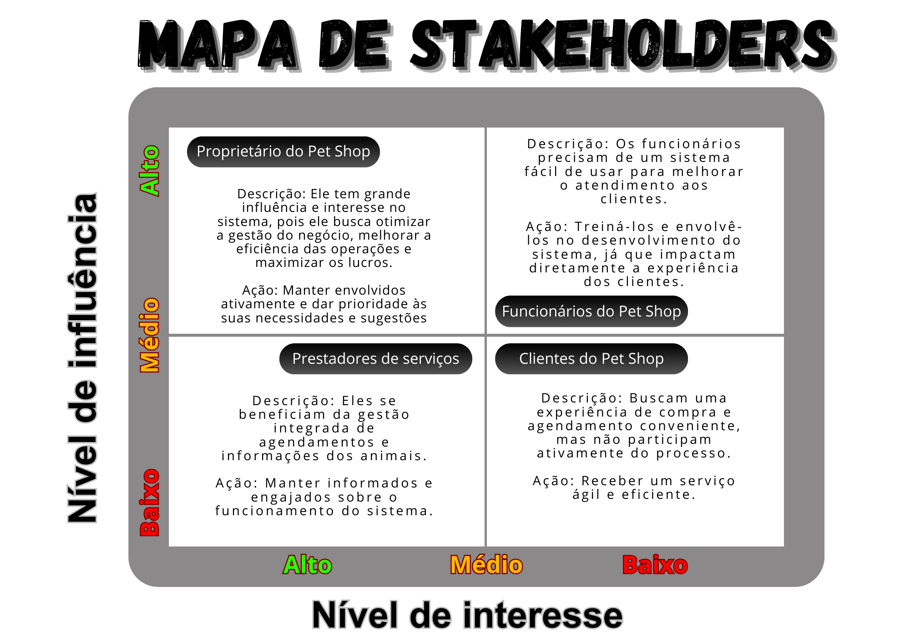

# Introdução

O mercado pet no Brasil tem mostrado um crescimento significativo nos últimos anos. A demanda por serviços de qualidade, incluindo banho e tosa, aumentou consideravelmente, exigindo dos estabelecimentos um gerenciamento mais preciso e organizado. Além disso, a gestão eficiente de estoque é crucial para evitar perdas, otimizar recursos e garantir a disponibilidade dos produtos necessários para os cuidados dos animais. 

Este projeto tem como objetivo desenvolver um sistema de gestão integrado para pet shops, que abranja funcionalidades essenciais como controle de estoque, agendamento de serviços de banho e tosa e gestão de clientes. A implementação deste sistema visa aumentar a eficiência operacional, reduzir erros e retrabalho e oferecer uma plataforma centralizada e intuitiva. 

# Contexto 

Este projeto será desenvolvido para um pet shop de médio porte, localizado em um centro urbano e que oferece produtos e serviços para animais de estimação. Dentre esses produtos e serviços estão incluídos venda de rações, acessórios, medicamentos e serviços de banho e tosa. Atualmente, o pet shop utiliza métodos manuais e sistemas pouco integrados para gerenciar suas operações, o que resulta em ineficiências, erros e dificuldades na administração do negócio. A introdução de um sistema de gestão visa melhorar a eficiência operacional e proporcionar uma melhor experiência tanto para os funcionários quanto para os clientes. 

# Problema
A gestão de um pet shop envolve diversos problemas operacionais e administrativos que podem impactar negativamente a eficiência do negócio e a satisfação dos clientes. Entre os principais desafios enfrentados por pet shops estão: 

- Controle de Estoque Ineficiente: 
A falta de um sistema eficiente de controle de estoque pode levar a rupturas de produtos essenciais, excesso de itens menos demandados e dificuldades na reposição de produtos. Esse cenário não apenas leva à perda de vendas, mas também gera insatisfação entre os clientes que não encontram os produtos que precisam. 

- Agendamento de Serviços Conflitantes: 
 O agendamento manual de serviços de banho e tosa frequentemente resulta em conflitos de horário, atrasos e sobrecarga da equipe. Essa falta de organização compromete a qualidade do atendimento e a experiência dos clientes, que enfrentam esperas e serviços mal coordenados. 

- Falta de Integração entre Setores: 
 A ausência de um sistema integrado dificulta a comunicação e a coordenação entre os diferentes setores do pet shop, como vendas, serviços e atendimento ao cliente. Isso pode levar a inconsistências operacionais, tais como falta de produtos, agendamentos conflitantes e perda de dados importantes de clientes. Essa desorganização impacta negativamente a eficiência interna e o desempenho geral do negócio. 

## 4. Dificuldade na Gestão de Clientes: 
Sem um sistema adequado de gestão de clientes, torna-se difícil acompanhar o histórico de compras e serviços, entender as preferências dos clientes e fornecer um atendimento personalizado. Essa falta de informações valiosas prejudica a fidelização dos clientes e impede a criação de estratégias de marketing eficazes. 

Nesse momento, o grupo pode optar por fazer uso  de ferramentas como Design Thinking, que permite um olhar de ponta a ponta para o problema.

> **Links Úteis**:
> - [Objetivos, Problema de pesquisa e Justificativa](https://medium.com/@versioparole/objetivos-problema-de-pesquisa-e-justificativa-c98c8233b9c3)
> - [Matriz Certezas, Suposições e Dúvidas](https://medium.com/educa%C3%A7%C3%A3o-fora-da-caixa/matriz-certezas-suposi%C3%A7%C3%B5es-e-d%C3%BAvidas-fa2263633655)
> - [Brainstorming](https://www.euax.com.br/2018/09/brainstorming/)

# Objetivos

## Objetivo Geral: 

Desenvolver um sistema de gestão de pet shop que permita aos prestadores de serviços gerenciar os estoques dos produtos e agendar banhos e tosas, otimizando a eficiência operacional e melhorando a experiência do cliente. 

## Objetivos Específicos: 

## - Automatização do controle de estoque: 
Implementar um sistema que permita o monitoramento em tempo real dos produtos, alertando sobre a necessidade de reposição e evitando excessos. 

## - Otimização do Agendamento de Serviços: 
Introduzir um sistema digital de agendamento para organizar os horários de forma eficiente, minimizando conflitos e atrasos. 

## - Gestão Eficaz de Clientes: 
Desenvolver uma plataforma para acompanhar o histórico de compras e serviços, entender as preferências dos clientes e fornecer um atendimento personalizado. 
 
> **Links Úteis**:
> - [Objetivo geral e objetivo específico: como fazer e quais verbos utilizar](https://blog.mettzer.com/diferenca-entre-objetivo-geral-e-objetivo-especifico/)

# Justificativa

O desenvolvimento de um sistema de gestão para um pet shop de médio porte surge da necessidade  de modernizar e otimizar as operações diárias do negócio. Esta inovação busca proporcionar uma experiência aprimorada para os clientes, ao mesmo tempo em que aumenta a eficiência operacional da empresa. A implementação de um sistema integrado de gestão pode trazer inúmeros benefícios, incluindo melhor controle de estoque, agendamento eficiente de serviços e excelência no atendimento aos clientes. 

# Metodologia 

O uso de ferramentas de Design Thinking permitirá uma análise completa do problema, identificando as necessidades dos usuários e criando soluções inovadoras e centradas no usuário. A metodologia inclui as seguintes etapas: 

## Empatia: 
Entendimento profundo das necessidades e problemas dos usuários. 

## Definição: 
Definição clara dos problemas a serem solucionados. 

## Ideação: 
Geração de ideias inovadoras para resolver os problemas identificados. 

## Prototipagem: 
Criação de protótipos do sistema para testar as soluções propostas. 

## Testes:
Avaliação dos protótipos com os usuários e ajustes conforme necessário. 

> **Links Úteis**:
> - [Como montar a justificativa](https://guiadamonografia.com.br/como-montar-justificativa-do-tcc/)

# Público-Alvo

O público-alvo do nosso sistema de gestão para pet shops são os funcionários e gestores do estabelecimento, que utilizam a plataforma para otimizar os serviços e melhorar a organização interna.

## Perfis de usuários:

| Usuário                 | Conhecimentos Prévios                                                                 | Relação com a Tecnologia                                                                                     | Relações Hierárquicas                                    |
|-------------------------|--------------------------------------------------------------------------------------|-------------------------------------------------------------------------------------------------------------|----------------------------------------------------------|
| Proprietários de Pet Shop | Geralmente possuem conhecimento sobre o funcionamento do negócio e as necessidades dos clientes, mas podem ter pouca familiaridade com tecnologias avançadas. | Podem estar acostumados a usar sistemas simples ou até mesmo métodos manuais de gestão. A implementação de um sistema distribuído requer um aprendizado inicial, mas pode trazer grandes benefícios em termos de eficiência. | Geralmente ocupam cargos de gestão e tomada de decisão dentro do pet shop. |
| Funcionários de Pet Shop | Possuem conhecimento operacional sobre o atendimento ao cliente, manutenção do estoque e prestação de serviços. Podem ter variação no nível de familiaridade com tecnologias, dependendo de suas funções. | Alguns funcionários podem estar habituados a utilizar caixas registradoras e sistemas de ponto de venda (PDV), enquanto outros podem ter pouca experiência com sistemas mais complexos. | Podem incluir atendentes, auxiliares de serviços e gerentes de loja, todos necessitando de acesso a diferentes funcionalidades do sistema. |
| Prestadores de Serviços | São profissionais que têm conhecimentos técnicos e práticos sobre os cuidados com os animais, além de habilidades específicas relacionadas ao manuseio e higiene dos pets. | Possuem um nível de conforto variado com tecnologias, podendo estar habituados a sistemas de agendamento e prontuários eletrônicos. | Podem atuar como colaboradores internos ou prestadores de serviços externos. |

## 1. Proprietários de Pet Shop 

O dono do pet shop precisa de um sistema que otimize a operação do negócio, fornecendo funcionalidades como controle de estoque, agendamentos de serviços e relatórios. Ele busca soluções intuitivas, que facilitem a tomada de decisões e aumentem a eficiência do atendimento.

## 2. Funcionários (Técnico de Tosa/ Atendente)

Os profissional responsável por banho e tosa precisa de um sistema que facilite o agendamento de serviços, a organização da fila de atendimento e a personalização dos procedimentos para cada animal. Funcionalidades como alertas e lembretes de atendimento ajudam a melhorar a produtividade e evitar falhas no serviço.

O atendente utiliza o sistema para realizar cadastros de clientes e pets, agendar serviços, registrar vendas de produtos e processar pagamentos. Para esse público, um sistema ágil, intuitivo e de fácil navegação é fundamental para otimizar o tempo de trabalho e melhorar a experiência do cliente.

## 3. Fornecedores de produto

Alguns pet shops mantêm relações com fornecedores de rações, medicamentos, acessórios e outros produtos. Um módulo de gestão de fornecedor, pedidos e faturamento pode facilitar a administração do estoque e garantir um fluxo de suprimentos eficiente.

# Diagrama de Personas:

# Mapa de Stakeholders:

Adicione informações sobre o público-alvo por meio de uma descrição textual, diagramas de personas e mapa de stakeholders.

> **Links Úteis**:
> - [Público-alvo](https://blog.hotmart.com/pt-br/publico-alvo/)
> - [Como definir o público alvo](https://exame.com/pme/5-dicas-essenciais-para-definir-o-publico-alvo-do-seu-negocio/)
> - [Público-alvo: o que é, tipos, como definir seu público e exemplos](https://klickpages.com.br/blog/publico-alvo-o-que-e/)
> - [Qual a diferença entre público-alvo e persona?](https://rockcontent.com/blog/diferenca-publico-alvo-e-persona/)

# Especificações do Projeto

## Requisitos

As tabelas que se seguem apresentam os requisitos funcionais e não funcionais que detalham o escopo do projeto.

### Requisitos Funcionais

|ID    | Descrição do Requisito  | Prioridade |
|------|-----------------------------------------|----|
|RF-001 | Permitir o cadastro de pets| ALTA |
|RF-002 | Permitir o cadastro de clientes| ALTA|
|RF-003 | Permitir o cadastro de produtos| ALTA|
|RF-004 | Permitir o cadastro de serviços| ALTA|
|RF-005 | Permitir o cadastro de usuarios| ALTA|
|RF-006 | Permitir gerenciamento de usuários| ALTA|
|RF-007 | Permitir agendamento de serviços| ALTA|
|RF-008 | Permitir login do usuário| ALTA|
|RF-009 | Permitir resetar senha do usuário| MÉDIA|

### Requisitos não Funcionais

|ID     | Descrição do Requisito  |Prioridade |
|-------|-------------------------|----|
|RNF-001| O sistema deve ser responsivo para rodar em um dispositivos móvel | MÉDIA | 
|RNF-002| Deve processar requisições do usuário em no máximo 3s |  BAIXA | 

Com base nas Histórias de Usuário, enumere os requisitos da sua solução. Classifique esses requisitos em dois grupos:

- [Requisitos Não Funcionais
  (RNF)](https://pt.wikipedia.org/wiki/Requisito_n%C3%A3o_funcional):
  correspondem a uma característica técnica, seja de usabilidade,
  desempenho, confiabilidade, segurança ou outro (ex: suporte a
  dispositivos iOS e Android).
Lembre-se que cada requisito deve corresponder à uma e somente uma
característica alvo da sua solução. Além disso, certifique-se de que
todos os aspectos capturados nas Histórias de Usuário foram cobertos.

## Restrições

O projeto está restrito pelos itens apresentados na tabela a seguir.

|ID| Restrição                                             |
|--|-------------------------------------------------------|
|01| O projeto deverá ser entregue até o final do semestre |
|02| Não pode ser desenvolvido um módulo de backend        |

Enumere as restrições à sua solução. Lembre-se de que as restrições geralmente limitam a solução candidata.

> **Links Úteis**:
> - [O que são Requisitos Funcionais e Requisitos Não Funcionais?](https://codificar.com.br/requisitos-funcionais-nao-funcionais/)
> - [O que são requisitos funcionais e requisitos não funcionais?](https://analisederequisitos.com.br/requisitos-funcionais-e-requisitos-nao-funcionais-o-que-sao/)

# Catálogo de Serviços

Cadastro de Usuários: O usuário poderá se cadastrar na plataforma inserindo seu e-mail, CPF e senha, sendo necessário confirmar esta última. Esse processo enviará uma requisição do tipo POST para a API REST, 
que encaminhará os dados ao backend para que sejam registrados no banco de dados POSTGRE SQL.

Cadastro de Pets: O usuário poderá cadastrar pets na plataforma. Para isso, deverá preencher um formulário com a raça, o nome, a cor e, opcionalmente, observações. 
Esse cadastro enviará uma requisição do tipo POST para a API REST, que encaminhará os dados ao backend para que sejam registrados no banco de dados POSTGRE SQL.

Edição de Pets: O usuário poderá editar os pets na plataforma. Para isso, deverá preencher um formulário com a raça, o nome, a cor e, opcionalmente, observações. 
Esse cadastro enviará uma requisição do tipo PATCH para a API REST, que encaminhará os dados ao backend para que sejam atualizados no banco de dados POSTGRE SQL.

Autenticação: Ao submeter o formulário de login, a plataforma enviará uma requisição POST para a API REST, que verificará as credenciais no backend. Se estiverem corretas, o sistema gerará um token de autenticação (como um Json Web Token), 
permitindo o acesso seguro às funcionalidades da plataforma. O token será usado em requisições futuras para autenticar o usuário até expirar ou o usuário realizar o logout. Caso as credenciais estejam incorretas, o acesso será negado e o usuário notificado.

# Arquitetura da Solução

Definição de como o software é estruturado em termos dos componentes que fazem parte da solução e do ambiente de hospedagem da aplicação.

## Tecnologias Utilizadas

Descreva aqui qual(is) tecnologias você vai usar para resolver o seu problema, ou seja, implementar a sua solução. Liste todas as tecnologias envolvidas, linguagens a serem utilizadas, serviços web, frameworks, bibliotecas, IDEs de desenvolvimento, e ferramentas.

Apresente também uma figura explicando como as tecnologias estão relacionadas ou como uma interação do usuário com o sistema vai ser conduzida, por onde ela passa até retornar uma resposta ao usuário.

## Hospedagem

Explique como a hospedagem e o lançamento da plataforma foi feita.

> **Links Úteis**:
>
> - [Website com GitHub Pages](https://pages.github.com/)
> - [Programação colaborativa com Repl.it](https://repl.it/)
> - [Getting Started with Heroku](https://devcenter.heroku.com/start)
> - [Publicando Seu Site No Heroku](http://pythonclub.com.br/publicando-seu-hello-world-no-heroku.html)
