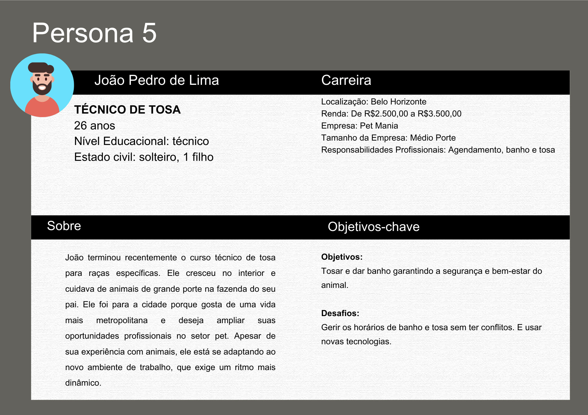

# Introdução

O mercado pet no Brasil tem mostrado um crescimento significativo nos últimos anos. A demanda por serviços de qualidade, incluindo banho e tosa, aumentou consideravelmente, exigindo dos estabelecimentos um gerenciamento mais preciso e organizado. Além disso, a gestão eficiente de estoque é crucial para evitar perdas, otimizar recursos e garantir a disponibilidade dos produtos necessários para os cuidados dos animais. 

Este projeto tem como objetivo desenvolver um sistema de gestão integrado para pet shops, que abranja funcionalidades essenciais como controle de estoque, agendamento de serviços de banho e tosa e gestão de clientes. A implementação deste sistema visa aumentar a eficiência operacional, reduzir erros e retrabalho e oferecer uma plataforma centralizada e intuitiva. 

# Contexto 

Este projeto será desenvolvido para um pet shop de médio porte, localizado em um centro urbano e que oferece produtos e serviços para animais de estimação. Dentre esses produtos e serviços estão incluídos venda de rações, acessórios, medicamentos e serviços de banho e tosa. Atualmente, o pet shop utiliza métodos manuais e sistemas pouco integrados para gerenciar suas operações, o que resulta em ineficiências, erros e dificuldades na administração do negócio. A introdução de um sistema de gestão visa melhorar a eficiência operacional e proporcionar uma melhor experiência tanto para os funcionários quanto para os clientes. 

# Problema
A gestão de um pet shop envolve diversos problemas operacionais e administrativos que podem impactar negativamente a eficiência do negócio e a satisfação dos clientes. Entre os principais desafios enfrentados por pet shops estão: 

- Controle de Estoque Ineficiente: 
A falta de um sistema eficiente de controle de estoque pode levar a rupturas de produtos essenciais, excesso de itens menos demandados e dificuldades na reposição de produtos. Esse cenário não apenas leva à perda de vendas, mas também gera insatisfação entre os clientes que não encontram os produtos que precisam. 

- Agendamento de Serviços Conflitantes: 
 O agendamento manual de serviços de banho e tosa frequentemente resulta em conflitos de horário, atrasos e sobrecarga da equipe. Essa falta de organização compromete a qualidade do atendimento e a experiência dos clientes, que enfrentam esperas e serviços mal coordenados. 

- Falta de Integração entre Setores: 
 A ausência de um sistema integrado dificulta a comunicação e a coordenação entre os diferentes setores do pet shop, como vendas, serviços e atendimento ao cliente. Isso pode levar a inconsistências operacionais, tais como falta de produtos, agendamentos conflitantes e perda de dados importantes de clientes. Essa desorganização impacta negativamente a eficiência interna e o desempenho geral do negócio. 

- Dificuldade na Gestão de Clientes: 
Sem um sistema adequado de gestão de clientes, torna-se difícil acompanhar o histórico de compras e serviços, entender as preferências dos clientes e fornecer um atendimento personalizado. Essa falta de informações valiosas prejudica a fidelização dos clientes e impede a criação de estratégias de marketing eficazes. 

# Objetivos

## Objetivo Geral: 

Desenvolver um sistema de gestão de pet shop que permita aos prestadores de serviços gerenciar os estoques dos produtos e agendar banhos e tosas, otimizando a eficiência operacional e melhorando a experiência do cliente. 

## Objetivos Específicos: 

- Automatização do controle de estoque: 
Implementar um sistema que permita o monitoramento em tempo real dos produtos, alertando sobre a necessidade de reposição e evitando excessos. 

- Otimização do Agendamento de Serviços: 
Introduzir um sistema digital de agendamento para organizar os horários de forma eficiente, minimizando conflitos e atrasos. 

- Gestão Eficaz de Clientes: 
Desenvolver uma plataforma para acompanhar o histórico de compras e serviços, entender as preferências dos clientes e fornecer um atendimento personalizado. 

# Justificativa

O desenvolvimento de um sistema de gestão para um pet shop de médio porte surge da necessidade  de modernizar e otimizar as operações diárias do negócio. Esta inovação busca proporcionar uma experiência aprimorada para os clientes, ao mesmo tempo em que aumenta a eficiência operacional da empresa. A implementação de um sistema integrado de gestão pode trazer inúmeros benefícios, incluindo melhor controle de estoque, agendamento eficiente de serviços e excelência no atendimento aos clientes. 

# Metodologia 

O uso de ferramentas de Design Thinking permitirá uma análise completa do problema, identificando as necessidades dos usuários e criando soluções inovadoras e centradas no usuário. A metodologia inclui as seguintes etapas: 

- Empatia: 
Entendimento profundo das necessidades e problemas dos usuários. 

- Definição: 
Definição clara dos problemas a serem solucionados. 

- Ideação: 
Geração de ideias inovadoras para resolver os problemas identificados. 

- Prototipagem: 
Criação de protótipos do sistema para testar as soluções propostas. 

- Testes:
Avaliação dos protótipos com os usuários e ajustes conforme necessário. 

# Público-Alvo

O sistema de gestão de serviços para pet shops tem como público-alvo os funcionários e gestores desses estabelecimentos, que necessitam de um sistema eficiente para otimizar a organização interna e melhorar a prestação de serviços. Os principais usuários do sistema são os proprietários de pet shops, os funcionários (atendentes e os técnicos de banho e tosa).

Os proprietários de pet shops, geralmente entre 30 e 55 anos, possuem experiência na administração do negócio e amplo conhecimento sobre as necessidades dos clientes, mas podem ter pouca familiaridade com tecnologias avançadas. Muitos ainda utilizam métodos manuais ou sistemas simples para a gestão de agendamentos, controle de estoque e atendimento ao cliente. Para esse grupo, o sistema oferece uma solução intuitiva, que permite a automatização de processos e a obtenção de relatórios detalhados para embasar a tomada de decisões estratégicas.

Os funcionários do pet shop, que incluem atendentes e técnicos de banho e tosa, têm idades variando entre 18 e 40 anos e diferentes níveis de familiaridade com tecnologia. Os atendentes são responsáveis pelo cadastro de clientes e pets, agendamento de serviços, processamento de pagamentos e venda de produtos. Para esse público, um sistema intuitivo e de fácil navegação é essencial para otimizar o tempo de trabalho e melhorar a experiência do cliente. Já os técnicos de tosa necessitam de funcionalidades que facilitem a organização da fila de atendimento, o agendamento dos serviços e a personalização dos procedimentos para cada animal. O uso de alertas e lembretes automatizados auxilia na execução eficiente das tarefas, minimizando erros operacionais.

## Perfis de usuários:

| Usuário                 | Conhecimentos Prévios                                                                 | Relação com a Tecnologia                                                                                     | Relações Hierárquicas                                    |
|-------------------------|--------------------------------------------------------------------------------------|-------------------------------------------------------------------------------------------------------------|----------------------------------------------------------|
| Proprietários de Pet Shop | Geralmente possuem conhecimento sobre o funcionamento do negócio e as necessidades dos clientes, mas podem ter pouca familiaridade com tecnologias avançadas. | Podem estar acostumados a usar sistemas simples ou até mesmo métodos manuais de gestão. A implementação de um sistema distribuído requer um aprendizado inicial, mas pode trazer grandes benefícios em termos de eficiência. | Geralmente ocupam cargos de gestão e tomada de decisão dentro do pet shop. |
| Funcionários de Pet Shop | Possuem conhecimento operacional sobre o atendimento ao cliente, manutenção do estoque e prestação de serviços. Podem ter variação no nível de familiaridade com tecnologias, dependendo de suas funções. | Alguns funcionários podem estar habituados a utilizar caixas registradoras e sistemas de ponto de venda (PDV), enquanto outros podem ter pouca experiência com sistemas mais complexos. | Podem incluir atendentes, auxiliares de serviços e gerentes de loja, todos necessitando de acesso a diferentes funcionalidades do sistema. |

- Proprietários de Pet Shop 

O dono do pet shop precisa de um sistema que otimize a operação do negócio, fornecendo funcionalidades como controle de estoque, agendamentos de serviços e relatórios. Ele busca soluções intuitivas, que facilitem a tomada de decisões e aumentem a eficiência do atendimento.

- Funcionários (Técnico de Tosa/ Atendente)

Os profissional responsável por banho e tosa precisa de um sistema que facilite o agendamento de serviços, a organização da fila de atendimento e a personalização dos procedimentos para cada animal. Funcionalidades como alertas e lembretes de atendimento ajudam a melhorar a produtividade e evitar falhas no serviço.

O atendente utiliza o sistema para realizar cadastros de clientes e pets, agendar serviços, registrar vendas de produtos e processar pagamentos. Para esse público, um sistema ágil, intuitivo e de fácil navegação é fundamental para otimizar o tempo de trabalho e melhorar a experiência do cliente.

# Diagrama de Personas:

O Diagrama de Personas a seguir apresenta informações detalhadas sobre cada perfil de usuário em cards individuais, destacando suas necessidades e expectativas. 

# Mapa de Stakeholders:

O Mapa de Stakeholders apresenta os diferentes grupos envolvidos no sistema de gestão do pet shop, organizando-os com base em seu nível de influência e interesse na plataforma.

- O proprietário do pet shop possui alta influência e alto interesse, pois busca otimizar a administração, melhorar a eficiência das operações e maximizar os lucros.  

- Os funcionários do pet shop possuem alta influência e alto interesse, pois são os maiores usuários do sistema e responsáveis pelo atendimento e execução dos serviços. Para garantir o sucesso da implementação, é essencial treiná-los e mantê-los informados e engajados na execução do sistema. 

- Os clientes do pet shop têm baixo interesse e média influência, pois algumas decisões são embasadas em sua nescessidade e comportamento. Utilizam indiretamente o sistema por meio do uso dos serviços.

- Os fornecedores têm baixo interesse e baixa influência porque seu envolvimento com o sistema é limitado. Eles apenas receberão relatórios para repor estoques de produtos e insumos para o pet shop, sem interação direta com a plataforma. Seu impacto não tem influência ativa sobre o funcionamento da gestão interna do pet shop.

# Especificações do Projeto

## Requisitos

As tabelas que se seguem apresentam os requisitos funcionais e não funcionais que detalham o escopo do projeto.

### Requisitos Funcionais

|ID    | Descrição do Requisito  | Prioridade |
|------|-----------------------------------------|----|
|RF-001 | Permitir o cadastro de pets| ALTA |
|RF-002 | Permitir o cadastro de clientes| ALTA|
|RF-003 | Permitir o cadastro de produtos| ALTA|
|RF-004 | Permitir o cadastro de serviços| ALTA|
|RF-005 | Permitir o cadastro de usuarios| ALTA|
|RF-006 | Permitir gerenciamento de usuários| ALTA|
|RF-007 | Permitir agendamento de serviços| ALTA|
|RF-008 | Permitir login do usuário| ALTA|
|RF-009 | Permitir resetar senha do usuário| MÉDIA|

### Requisitos não Funcionais

|ID     | Descrição do Requisito  |Prioridade |
|-------|-------------------------|----|
|RNF-001| O sistema deve ser responsivo para rodar em um dispositivos móvel | MÉDIA | 
|RNF-002| Deve processar requisições do usuário em no máximo 3s |  BAIXA | 

## Restrições

O projeto está restrito pelos itens apresentados na tabela a seguir.

|ID| Restrição                                             |
|--|-------------------------------------------------------|
|01| O projeto deverá ser entregue até o final do semestre |
|02| Não pode ser desenvolvido um módulo de backend        |

# Catálogo de Serviços

Cadastro de Usuários: O admnistrador do sistema poderá cadastrar um usuário na plataforma inserindo seu e-mail, CPF e senha, sendo necessário confirmar esta última. Esse processo enviará uma requisição do tipo POST para a API REST, que encaminhará os dados ao backend para que sejam registrados no banco de dados POSTGRE SQL.

Gerenciamento de Pets: O usuário poderá cadastrar, editar e excluir pets na plataforma. Para cadastrar, deverá informar o CPF do cliente que possui o pet e preencher um formulário com a raça, o nome, a cor e, opcionalmente, observações. Esse cadastro enviará uma requisição do tipo POST para a API REST, que encaminhará os dados para o backend, onde serão registrados no banco de dados PostgreSQL. Para editar, o usuário deverá buscar o CPF do cliente que possui o pet, selecionar o pet que deseja editar e preencher apenas os campos que deseja alterar, utilizando o mesmo formulário de cadastro. Essa edição enviará uma requisição do tipo PATCH para a API REST, que encaminhará os dados para o backend, onde serão alterados no banco de dados PostgreSQL.

Cadastro de Produtos: 

Autenticação: Ao submeter o formulário de login, a plataforma enviará uma requisição POST para a API REST, que verificará as credenciais no backend. Se estiverem corretas, o sistema gerará um token de autenticação (como um Json Web Token), permitindo o acesso seguro às funcionalidades da plataforma. O token será usado em requisições futuras para autenticar o usuário até expirar ou o usuário realizar o logout. Caso as credenciais estejam incorretas, o acesso será negado e o usuário notificado.

# Arquitetura da Solução

Definição de como o software é estruturado em termos dos componentes que fazem parte da solução e do ambiente de hospedagem da aplicação.

## Tecnologias Utilizadas

Para implementar a solução de gestão integrada para pet shops, vamos utilizar um conjunto de tecnologias que abrangem tanto o front-end quanto o back-end, além de serviços de hospedagem e ferramentas de desenvolvimento. Aqui está a lista detalhada das tecnologias envolvidas:

Linguagens de Programação:
JavaScript: Utilizada para o desenvolvimento de front-end (React) e back-end (Node.js).

Front-End:
React: Biblioteca JavaScript para construir interfaces de usuário interativas e responsivas.

HTML5 e CSS3: Para estruturação e estilização das páginas web.

Bootstrap: Framework CSS para design responsivo e componentes reutilizáveis.

Back-End:
Node.js: Ambiente de execução JavaScript para desenvolvimento do servidor.

Banco de Dados
PostgreSQL: Sistema de gerenciamento de banco de dados relacional para armazenar informações de clientes, pets, produtos e agendamentos.

Ferramentas de Desenvolvimento e Colaboração:
GitHub: Controle de versão e colaboração em código fonte.
Visual Studio Code (VSCode): IDE de desenvolvimento para escrita e depuração de código.

Serviços Web:
JSON Web Token (JWT): Utilizado para autenticação e autorização segura dos usuários.

Descreva aqui qual(is) tecnologias você vai usar para resolver o seu problema, ou seja, implementar a sua solução. Liste todas as tecnologias envolvidas, linguagens a serem utilizadas, serviços web, frameworks, bibliotecas, IDEs de desenvolvimento, e ferramentas. 
Apresente também uma figura explicando como as tecnologias estão relacionadas ou como uma interação do usuário com o sistema vai ser conduzida, por onde ela passa até retornar uma resposta ao usuário.

## Hospedagem

Inicialmente, a hospedagem do sistema será feita em servidores locais, permitindo um ambiente de desenvolvimento e testes controlado, onde ajustes poderão ser realizados antes da implementação definitiva. Durante essa fase, serão analisados o desempenho, a usabilidade e a estabilidade do sistema. Após essa etapa, a plataforma será migrada para a AWS, utilizando a infraestrutura oferecida pelo curso de Sistemas de Informação da PucMinas, que disponibiliza acesso à nuvem para os estudantes. A migração para a AWS trará benefícios como escalabilidade, disponibilidade e segurança.

> **Links Úteis**:
>
> - [Website com GitHub Pages](https://pages.github.com/)
> - [Programação colaborativa com Repl.it](https://repl.it/)
> - [Getting Started with Heroku](https://devcenter.heroku.com/start)
> - [Publicando Seu Site No Heroku](http://pythonclub.com.br/publicando-seu-hello-world-no-heroku.html)
