# Front-end Móvel

O projeto tem como objetivo fornecer uma interface mobile intuitiva, acessível e responsiva para a gestão de um pet shop. Através do front-end mobile, os usuários poderão realizar operações como consulta e cadastro de pets, clientes e agendamentos. O design e a usabilidade foram pensados para otimizar o fluxo de trabalho, facilitar o acesso às informações e garantir uma experiência agradável, prática e segura aos usuários em dispositivos móveis

## Projeto da Interface
A interface móvel foi projetada para oferecer uma navegação intuitiva e eficiente em dispositivos móveis. Com um layout limpo e responsivo, conta com barra de navegação inferior e telas organizadas por seções: Pets, Clientes, Agendamentos e Usuários. Cada página possui formulários simplificados, listas com filtros e ações rápidas. As interações priorizam poucos toques, uso de ícones intuitivos e feedbacks visuais, garantindo uma experiência ágil e produtiva para os colaboradores do pet shop.

### Wireframes

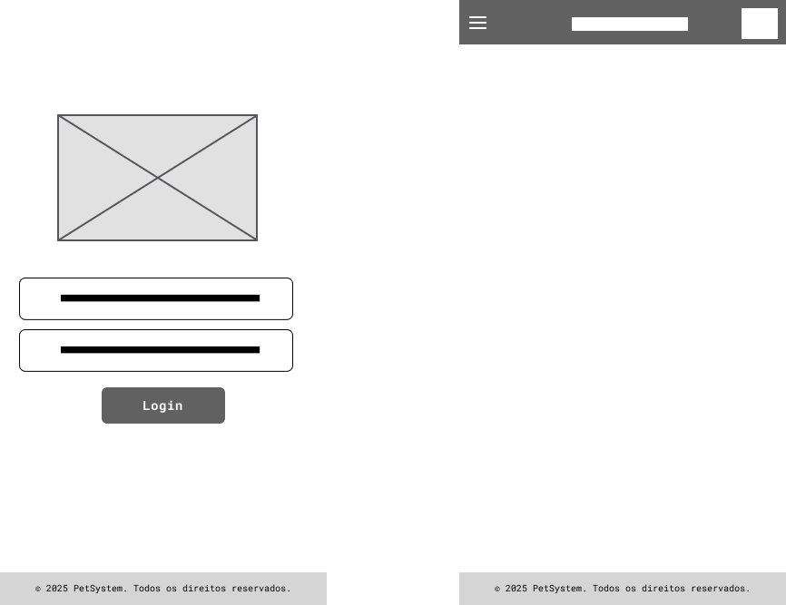
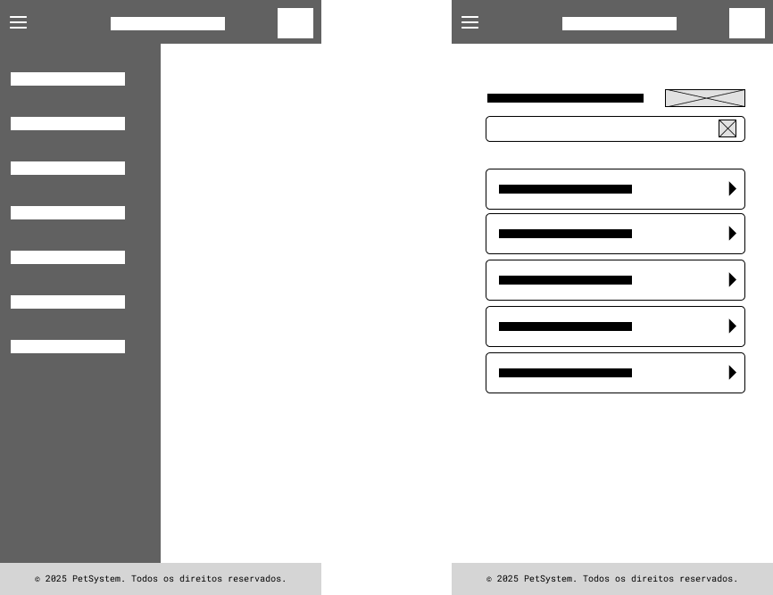
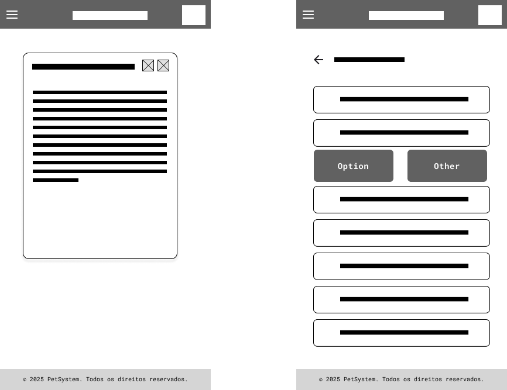

### Design Visual

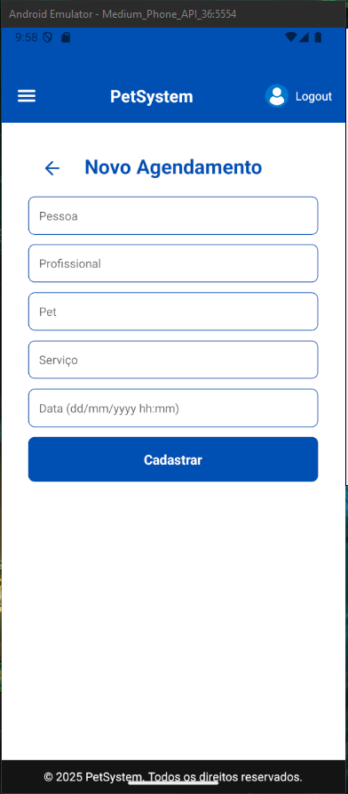

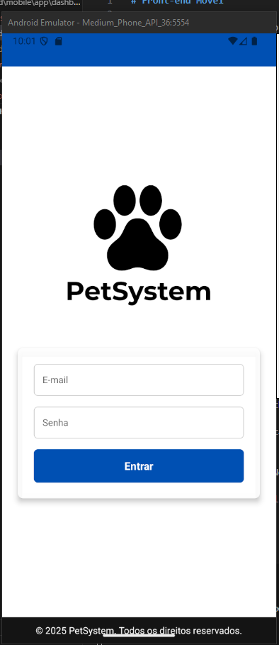
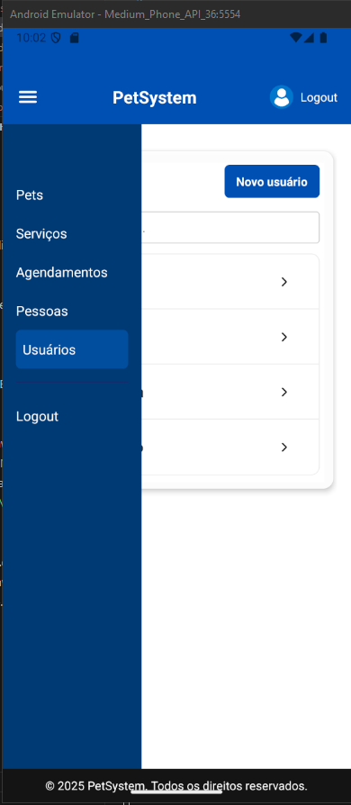
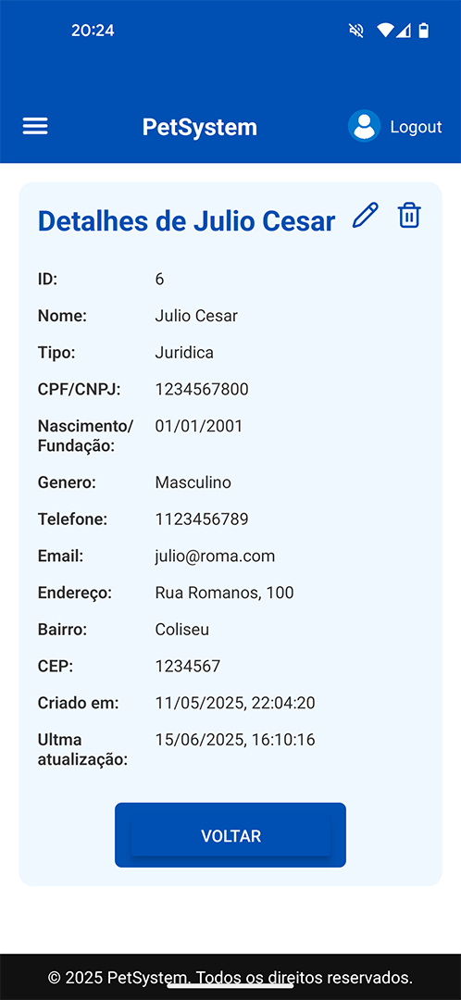
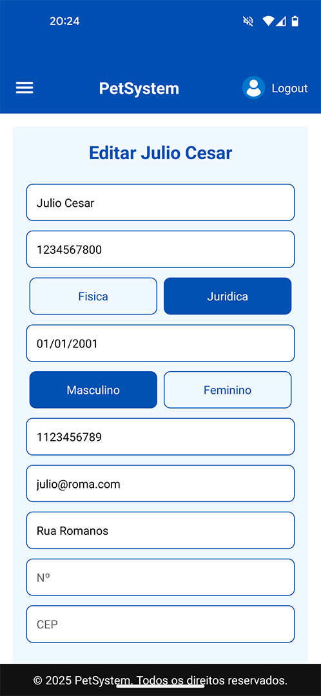

## Fluxo de Dados

O fluxo de dados da aplicação mobile do pet shop segue uma arquitetura baseada em CRUD (Create, Read, Update, Delete) e é organizado em camadas para garantir a separação de responsabilidades, segurança e performance. A seguir, descreve-se o ciclo típico de processamento de dados:

Interação do Usuário (Frontend Mobile)

O usuário interage com a interface mobile por meio de formulários, botões e menus. Essas ações geram requisições via HTTP ao servidor, utilizando métodos REST (GET, POST, PUT, DELETE).

Requisição ao Servidor (Backend)

O servidor recebe a solicitação e a redireciona para o controlador adequado (ex: PetController, AgendamentoController). Os dados da requisição são validados para garantir integridade e segurança.

Processamento e Regras de Negócio

O controlador repassa a solicitação para os serviços internos responsáveis pelas regras de negócio. Ex: Antes de registrar um agendamento, o sistema verifica se a data esta no formato correto.

Acesso ao Banco de Dados

Após o processamento, o serviço se comunica com o repositório ou camada de acesso a dados. Consultas, inserções ou atualizações são feitas no banco de dados relacional (PostgreSQL).

Resposta ao Usuário

O servidor envia uma resposta com o resultado da operação (sucesso, erro ou dados solicitados). A interface web exibe a informação ao usuário com mensagens de sucesso, erro ou atualização visual da tela.

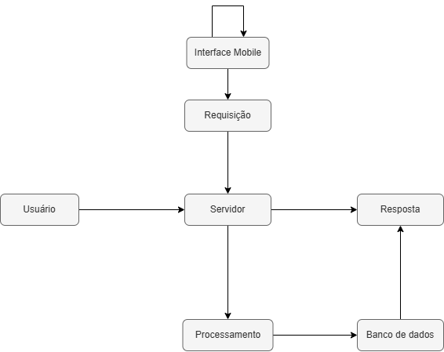

## Tecnologias Utilizadas
O desenvolvimento Mobile foi realizado utilizando as seguintes tecnologias principais:

Tamagui – Biblioteca de UI unificada para React Native, que oferece componentes estilizados com performance e acessibilidade, ideal para construção de interfaces responsivas e consistentes.

JavaScript e TypeScript – Linguagem de programação utilizada para o desenvolvimento de toda a lógica do projeto.

Expo (React Native) - Uma plataforma que simplifica o desenvolvimento, e visualização em Android ou IOS. O Expo oferece um fluxo de desenvolvimento mais rápido.
## Considerações de Segurança

A aplicação web foi projetada com diversas camadas de segurança para garantir a integridade dos dados, a proteção dos usuários e a resiliência contra ataques comuns em ambientes distribuídos. As principais considerações adotadas incluem:

- Autenticação: implementação de autenticação segura baseada em tokens (JWT) ou sessões; Senhas são armazenadas com hashing seguro (bcrypt ou Argon2), jamais em texto puro; Tempo de expiração configurável e renovação de tokens para minimizar riscos de sessões inativas.

- Autorização: controle de acesso baseado em papéis de usuário (roles), restringindo funcionalidades conforme permissões (ex: administrador, usuário); Validação de permissões em cada endpoint para evitar acesso não autorizado via requisições forjadas.

 - Proteção contra ataques comuns: Proteção contra CSRF (Cross-Site Request Forgery) usando tokens em formulários; Validação e sanitização de entradas para prevenir injeção de SQL/XSS; Uso de cabeçalhos de segurança (ex: Content-Security-Policy, X-Frame-Options, Strict-Transport-Security); Rate limiting e logging para detectar comportamentos anômalos e mitigar ataques de força bruta.

- Comunicação segura:toda comunicação entre cliente e servidor é feita via HTTPS, garantindo criptografia dos dados em trânsito;

## Implantação

* ###  Aplicativo Movel

1. Gerar arquivos IPA e APK para as respectivas plataformas iOS e Android em ambientes de desenvolvimentos
2. Geração de chaves e assinatura dos pacotes.
3. Envio dos pacotes para serem publicados nas respectivas lojas de aplicativos de cada plataforma, Andoid(Play Store) e iOS(App Store) 

# Plano de Testes de Software

## Requisitos Funcionais

## [RF-002](./contexto.md#rf-002): Permitir que o administrador delete um cliente.
> ### CT-002: Deletar um cliente do sistema.
- Pré condições: Precisará de uma conta com role de administrador.
- Passos:
  1. Logue no sistema e clique em pessoas na coluna lateral da esquerda.
  2. Procure o cliente desejado na tabela e clique no botão deletar deste cliente.
- Resultado esperado: Aparece um alert do navegador dizendo que o cliente foi deletado com sucesso.
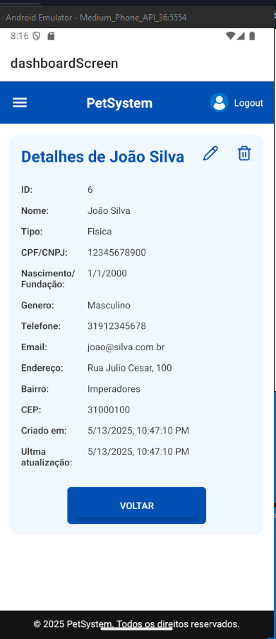
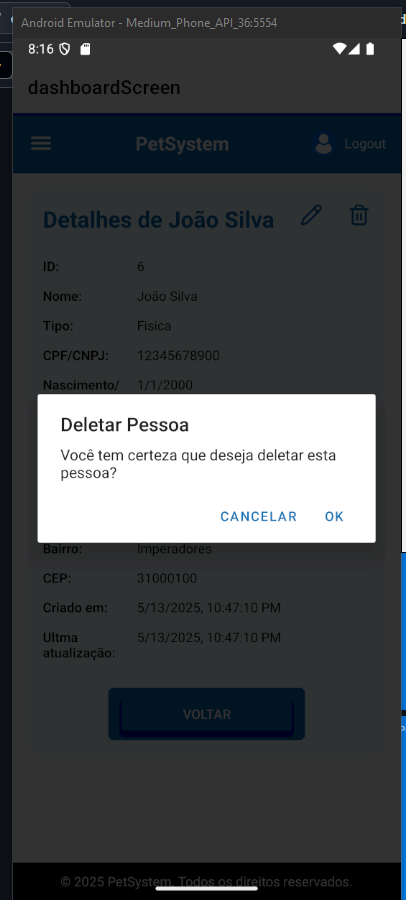
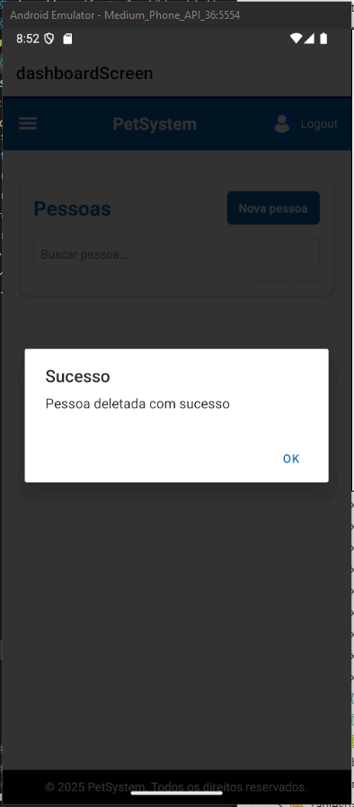

## [RF-005](./contexto.md#rf-005): Permitir que o administrador cadastre um usuário.
> ### CT-003: Cadastrar um novo usuário no sistema.
- Pré condições: Precisará de uma conta com role de administrador.
- Passos:
  1. Logue no sistema e clique em usuários na coluna lateral da esquerda.
  2. Clique no botão novo usuário, no canto superior direito.
  3. Preencha o formulário com dados válidos e selecione a role do usuário.
  4. Clique no botão cadastrar
- Resultado esperado: Aparece um alert do navegador dizendo que o usuário foi criado com sucesso.
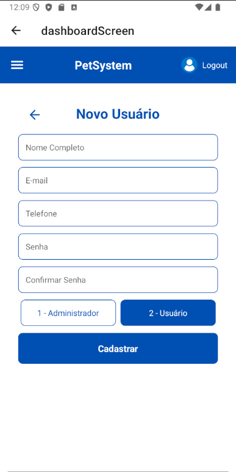
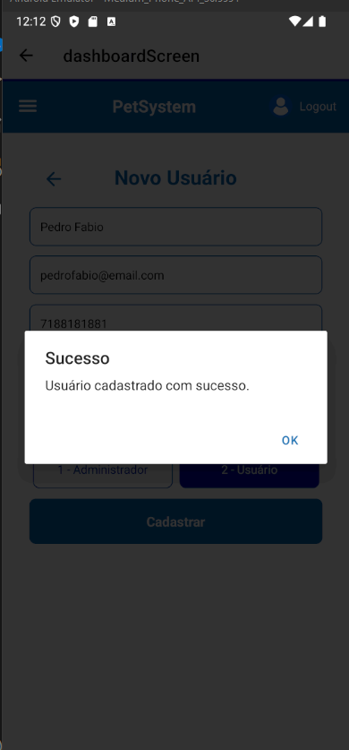

## [RF-006](./contexto.md#rf-006): Permitir que o usuário visualize todos agendamentos.
> ### CT-004: Ler os agendamentos do sistema.
- Pré condições: Existir agendamentos no sistema.
- Passos:
  1. Logue no sistema e clique em agendamentos na coluna lateral da esquerda.
  2. Aparecerá uma tabela com todos agendamentos existentes no sistema.
- Resultado esperado: Lista todos agendamentos existentes em uma tabela com paginação.
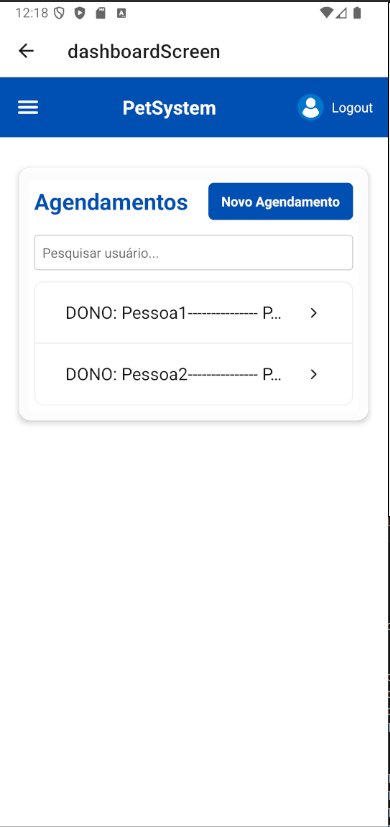

# Referências
NIELSEN, Jakob; BUDIU, Raluca. Mobile Usability. New Riders, 2012.

KRUG, Steve. Não me faça pensar: uma abordagem de bom senso à usabilidade na web e nos aplicativos móveis. Alta Books, 2014.

MATERIAL DESIGN. Guidelines for mobile UI/UX design. Disponível em: https://m3.material.io. Acesso em: 10 jun. 2025.

APPLE DEVELOPER. Human Interface Guidelines. Disponível em: https://developer.apple.com/design/human-interface-guidelines. Acesso em: 10 jun. 2025.

W3C. Web Accessibility Guidelines (WCAG) 2.1. Disponível em: https://www.w3.org/TR/WCAG21. Acesso em: 09 jun. 2025.

MDN Web Docs. Responsive Design Basics. Disponível em: https://developer.mozilla.org/. Acesso em: 09 jun. 2025.

FERREIRA, Fabio. UX Design: técnicas e práticas para o design de interfaces. Novatec Editora, 2020.

