# Front-end Web

O projeto tem como objetivo fornecer uma interface web intuitiva, acessível e responsiva para a gestão de um pet shop. Através do front-end, os usuários poderão realizar operações com consulta e cadastro de usuários pets, clientes e agendamentos. O design e a usabilidade foram pensados para otimizar o fluxo de trabalho, facilitar o acesso às informações e garantir uma experiência agradável e segura aos usuários.

## Projeto da Interface Web

A interface web foi desenvolvida com foco na usabilidade e na eficiência operacional dos colaboradores do pet shop. O layout é dividido em áreas de navegação lateral (menu), cabeçalho com atalhos e áreas centrais para exibição de conteúdo dinâmico. O sistema conta com páginas específicas para cada entidade (Usuários, Pets, Agendamentos, Pessoas), com formulários claros, listagens com filtros e ações rápidas como adicionar, editar e excluir. As interações do usuário são otimizadas para minimizar o número de cliques e maximizar a produtividade.

### Wireframes

A seguir wireframes de partes do sistema contendo o layout padrão desenvolvido.

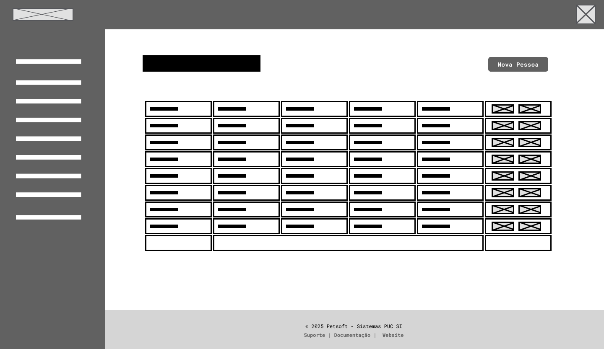
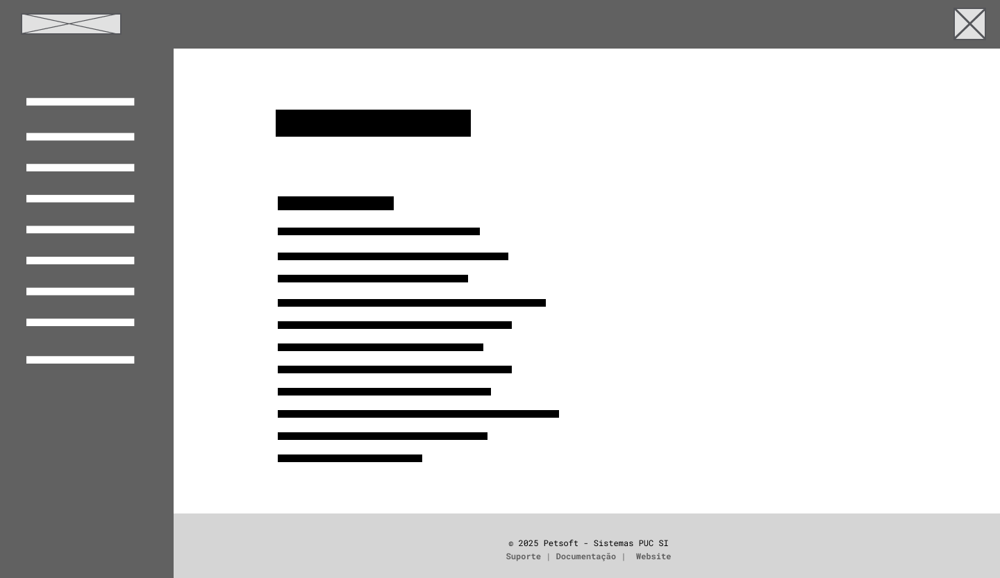
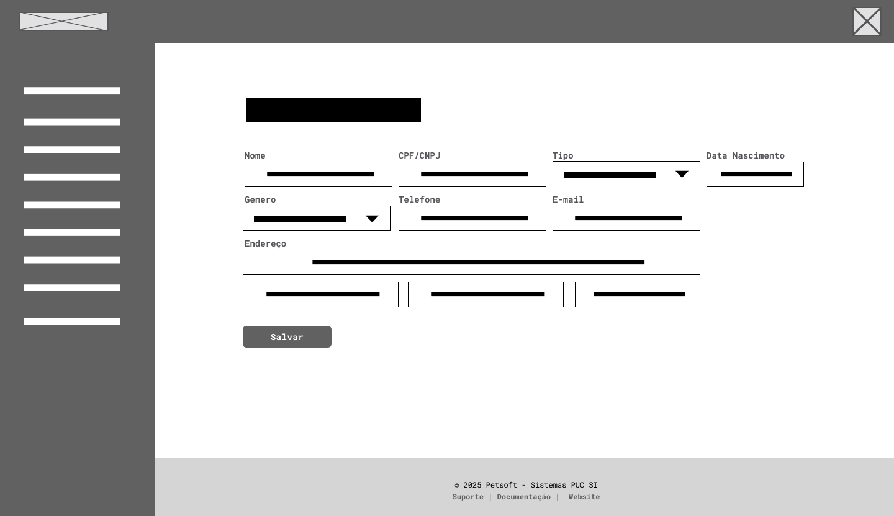

### Design Visual

Layout foi construindo baseado em um conceito limpo e utilizando cores amigáveis como o azul pensando em longo período de uso, o mesmo conceito aplicado também na escolha da fonte mas considerando a atualidade assim optamos pela fonte Inter. A seguir capturas das telas de login e uma tabela de registros do sistema.

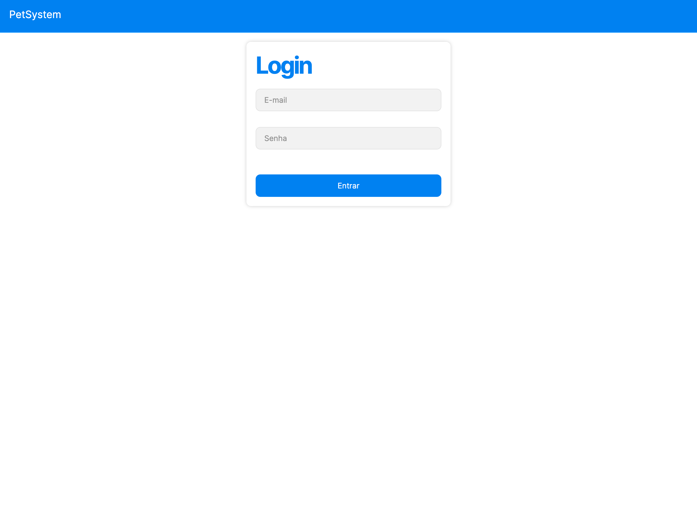
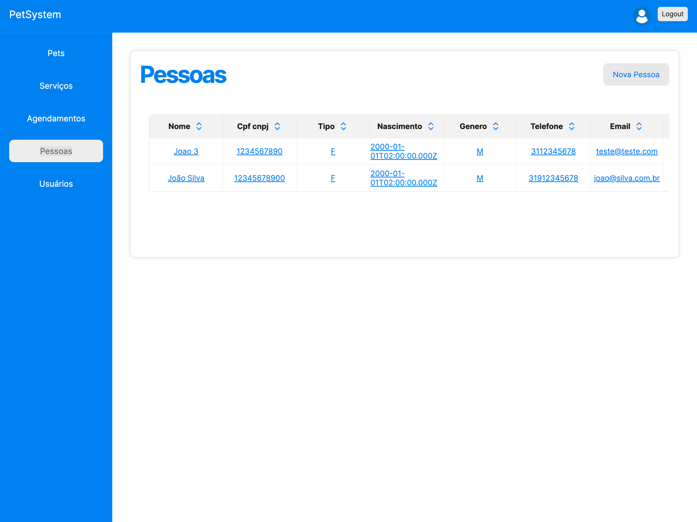

## Fluxo de Dados

O fluxo de dados da aplicação web do pet shop segue uma arquitetura baseada em CRUD (Create, Read, Update, Delete) e é organizado em camadas para garantir a separação de responsabilidades, segurança e performance. A seguir, descreve-se o ciclo típico de processamento de dados:

Interação do Usuário (Frontend)

O usuário interage com a interface web por meio de formulários, botões e menus. Essas ações geram requisições (via HTTP/HTTPS) ao servidor, utilizando métodos REST (GET, POST, PATCH, PUT, DELETE).

Requisição ao Servidor (Backend)

O servidor recebe a solicitação e a redireciona para o controlador adequado (ex: PetController, AgendamentoController). Os dados da requisição são validados para garantir integridade e segurança.

Processamento e Regras de Negócio

O controlador repassa a solicitação para os serviços internos responsáveis pelas regras de negócio. Ex: Antes de registrar um agendamento, o sistema verifica se o horário está disponível e se o cliente e o pet estão cadastrados.

Acesso ao Banco de Dados

Após o processamento, o serviço se comunica com o repositório ou camada de acesso a dados. Consultas, inserções ou atualizações são feitas no banco de dados relacional (PostgreSQL).

Resposta ao Usuário

O servidor envia uma resposta com o resultado da operação (sucesso, erro ou dados solicitados). A interface web exibe a informação ao usuário com mensagens de sucesso, erro ou atualização visual da tela.

## Tecnologias Utilizadas
Este projeto foi desenvolvido utilizando as seguintes tecnologias principais:

Next.js – Framework React para desenvolvimento web moderno, com suporte a SSR (Server-Side Rendering), rotas dinâmicas e API Routes.

Tamagui – Biblioteca de UI unificada para React Native e Web, que oferece componentes estilizados com performance e acessibilidade, ideal para construção de interfaces responsivas e consistentes.

JavaScript e TypeScript – Linguagem de programação utilizada para o desenvolvimento de toda a lógica do projeto.

Node.js + npm + yarn – Ambiente e gerenciadores de pacotes para instalação e execução das dependências.

## Considerações de Segurança

A aplicação web foi projetada com diversas camadas de segurança para garantir a integridade dos dados, a proteção dos usuários e a resiliência contra ataques comuns em ambientes distribuídos. As principais considerações adotadas incluem:

- Autenticação: implementação de autenticação segura baseada em tokens (JWT) ou sessões; Senhas são armazenadas com hashing seguro (bcrypt ou Argon2), jamais em texto puro; Tempo de expiração configurável e renovação de tokens para minimizar riscos de sessões inativas.

- Autorização: controle de acesso baseado em papéis de usuário (roles), restringindo funcionalidades conforme permissões (ex: administrador, usuário); Validação de permissões em cada endpoint para evitar acesso não autorizado via requisições forjadas.

 - Proteção contra ataques comuns: Proteção contra CSRF (Cross-Site Request Forgery) usando tokens em formulários; Validação e sanitização de entradas para prevenir injeção de SQL/XSS; Uso de cabeçalhos de segurança (ex: Content-Security-Policy, X-Frame-Options, Strict-Transport-Security); Rate limiting e logging para detectar comportamentos anômalos e mitigar ataques de força bruta.

- Comunicação segura:toda comunicação entre cliente e servidor é feita via HTTPS, garantindo criptografia dos dados em trânsito;

## Implantação

[Instruções para implantar a aplicação distribuída em um ambiente de produção.]

A implantação da aplicação em ambiente de produção (onde o sistema estará rodando com dados reais do pet shop e sendo usado pelos funcionários) requer atenção a aspectos de infraestrutura, segurança, escalabilidade e monitoramento. Abaixo estão as etapas recomendadas para garantir uma implantação segura e eficiente:

Hardware Backend / Frontend
Servidor Cloud na máquina virtual Ubuntu

CPU: 2 núcleos

RAM: 4 GB

Armazenamento: 10 GB SSD

Rede: conexão estável com IP público fixo

Hardware Banco de dados

Servidor Cloud na máquina virtual Debian

CPU: 1 núcleos

RAM: 2 GB

Armazenamento: 10 GB SSD

Rede: conexão estável com IP público fixo

Software

Backend: Node.js ; Express.js. 

Frontend: Next.js (React) com TypeScript; Tamagui (para design UI cross-platform); 

Banco de Dados: PostgreSQL (recomendado pela robustez e compatibilidade com Node.js)

Servidor Web / Proxy reverso: Nginx ou Apache

## Testes
1. Casos de Teste
Funcionais: Testar cadastro de pets, compra de produtos, agendamento de consultas e pesquisa de produtos/serviços.

# Plano de Testes de Software

## Requisitos Funcionais

## [RF-001](./contexto.md#rf-001): Permitir que o usuário ou administrador edite um pet
> ### CT-001: Atualizar as informações de um pet com dados válidos
- Pré condições: O pet já deve existir no sistema.
- Passos:
  1. Logue no sistema, clique em pets na coluna lateral da esquerda.
  2. Procure o pet que deseja editar e clique no botão editar deste.
  3. Preencha os campos que deseja editar e clique em atualizar pet.
- Resultado esperado: Os dados enviados são atualizados e as novas informações já aparecem na lista.
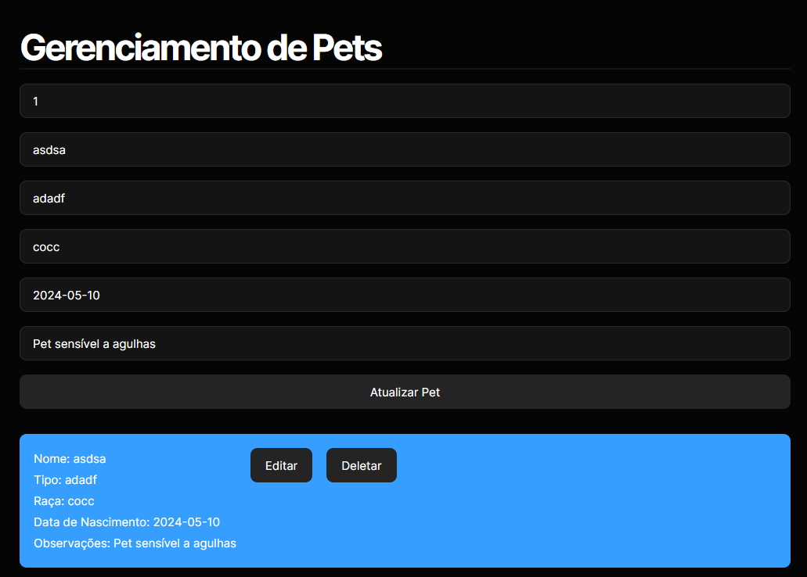
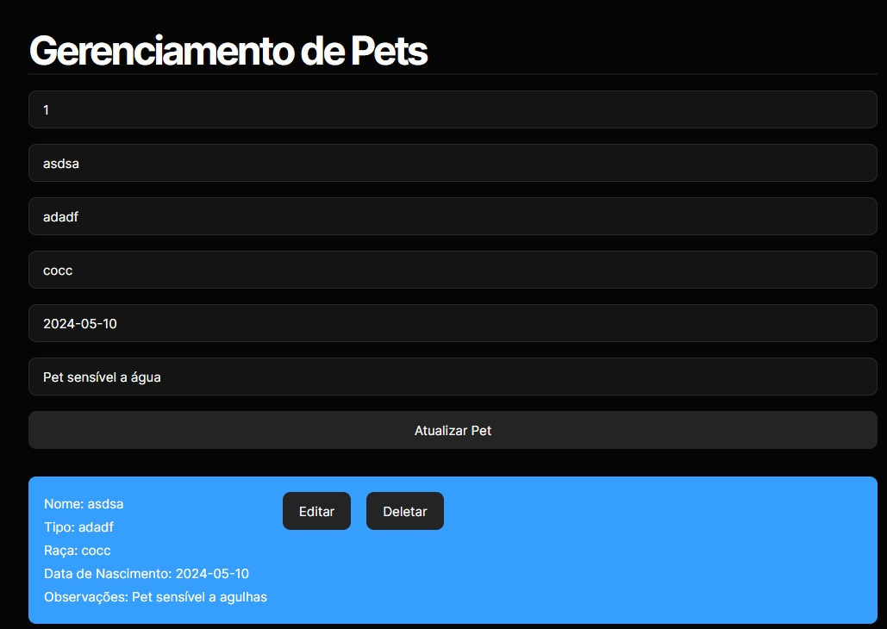
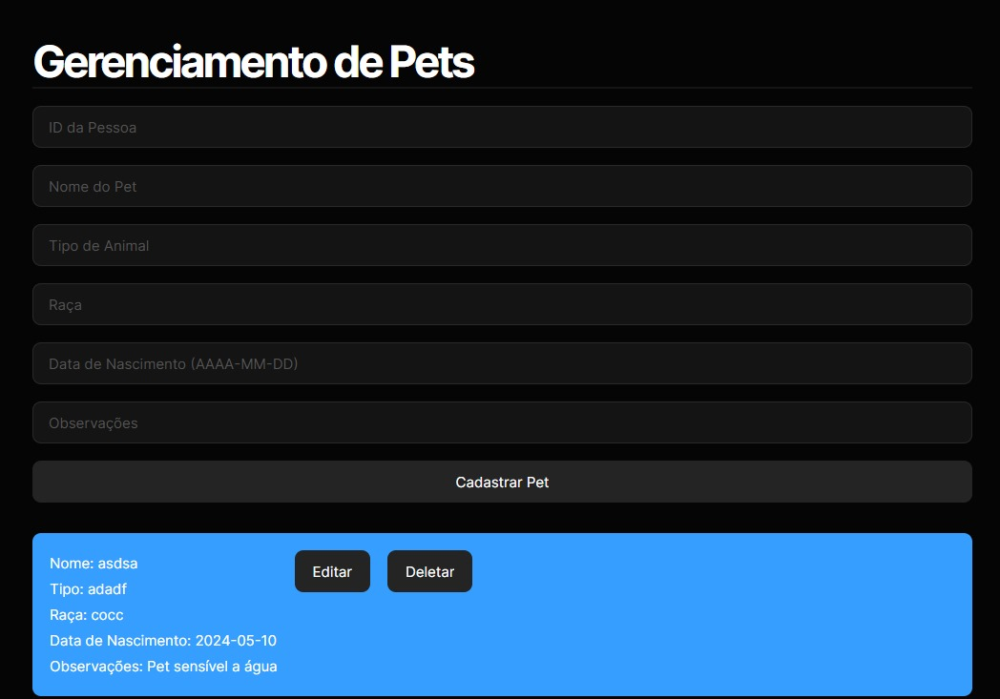

## [RF-002](./contexto.md#rf-002): Permitir que o administrador delete um cliente.
> ### CT-002: Deletar um cliente do sistema.
- Pré condições: Precisará de uma conta com role de administrador.
- Passos:
  1. Logue no sistema e clique em pessoas na coluna lateral da esquerda.
  2. Procure o cliente desejado na tabela e clique no botão deletar deste cliente.
- Resultado esperado: Aparece um alert do navegador dizendo que o cliente foi deletado com sucesso.
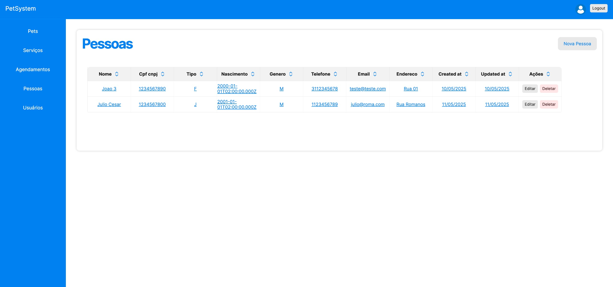
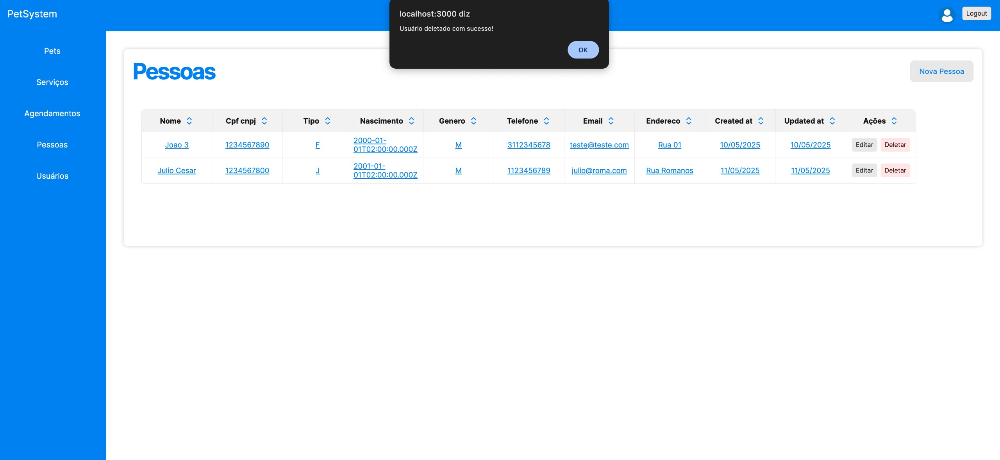

## [RF-005](./contexto.md#rf-005): Permitir que o administrador cadastre um usuário.
> ### CT-003: Cadastrar um novo usuário no sistema.
- Pré condições: Precisará de uma conta com role de administrador.
- Passos:
  1. Logue no sistema e clique em usuários na coluna lateral da esquerda.
  2. Clique no botão novo usuário, no canto superior direito.
  3. Preencha o formulário com dados válidos e selecione a role do usuário.
  4. Clique no botão cadastrar
- Resultado esperado: Aparece um alert do navegador dizendo que o usuário foi criado com sucesso.
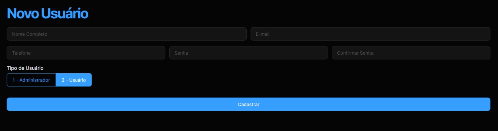
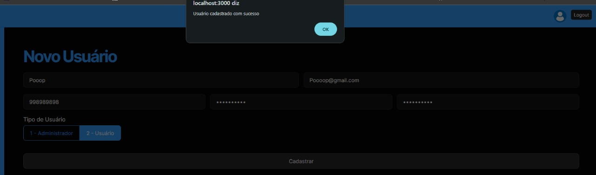

## [RF-006](./contexto.md#rf-006): Permitir que o usuário visualize todos agendamentos.
> ### CT-004: Ler os agendamentos do sistema.
- Pré condições: Existir agendamentos no sistema.
- Passos:
  1. Logue no sistema e clique em agendamentos na coluna lateral da esquerda.
  2. Aparecerá uma tabela com todos agendamentos existentes no sistema.
- Resultado esperado: Lista todos agendamentos existentes em uma tabela com paginação.
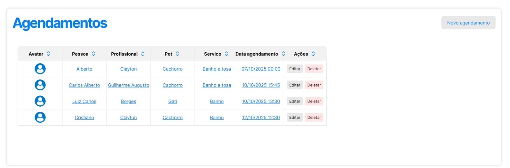

# Referências

BECK, Kent. Test-Driven Development: By Example. Boston: Addison-Wesley, 2002.

BROWN, Mike. Test Automation in Agile Projects: A Review. 2017. Disponível em: https://ieeexplore.ieee.org/document/8011347. Acesso em: 7 mai. 2025.

HUMBLE, Jez; FARLEY, David. Continuous Delivery: Reliable Software Releases through Build, Test, and Deployment Automation. 1. ed. Boston: Addison-Wesley, 2010.

MARTINS, Rafael. The Challenges of Load Testing in Continuous Integration. 2020. Disponível em: https://www.softwaretestinghelp.com/load-testing-continuous-integration/. Acesso em: 7 mai. 2025.

MYERS, Glenford J. The Art of Software Testing. 3. ed. New York: Wiley, 2011.

